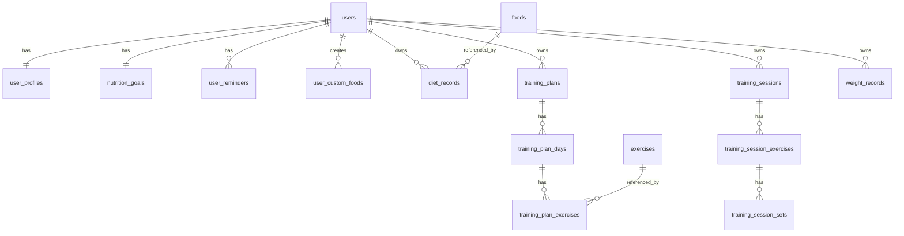

# 数据库表结构设计

> 数据库：MySQL 8.x  
> 字符集：utf8mb4  
> 存储引擎：InnoDB  
> 说明：字段设计已预留会员、AI 识别、数据导出、管理后台扩展能力。

---

## 1. 命名规范

1. 表名使用小写蛇形命名。
2. 主键统一使用 `id BIGINT AUTO_INCREMENT`。
3. 所有业务表包含 `created_at`、`updated_at`。
4. 需要软删除的表包含 `deleted_at`。
5. 金额、重量、营养值使用 `DECIMAL`，避免浮点误差。
6. 枚举字段使用 `VARCHAR`，便于扩展。

---

## 2. 核心 ER 关系



---

## 3. 用户相关表

### 3.1 users

用户主表。

```sql
CREATE TABLE users (
    id BIGINT PRIMARY KEY AUTO_INCREMENT,
    openid VARCHAR(128) NOT NULL UNIQUE,
    unionid VARCHAR(128) NULL,
    phone VARCHAR(32) NULL,
    nickname VARCHAR(100) NULL,
    avatar_url VARCHAR(500) NULL,
    status VARCHAR(32) NOT NULL DEFAULT 'active',
    is_member TINYINT NOT NULL DEFAULT 0,
    member_expired_at DATETIME NULL,
    membership_level VARCHAR(32) NULL,
    photo_recognition_count INT NOT NULL DEFAULT 0,
    last_login_at DATETIME NULL,
    agreement_version VARCHAR(32) NULL,
    agreement_confirmed_at DATETIME NULL,
    created_at DATETIME NOT NULL DEFAULT CURRENT_TIMESTAMP,
    updated_at DATETIME NOT NULL DEFAULT CURRENT_TIMESTAMP ON UPDATE CURRENT_TIMESTAMP,
    deleted_at DATETIME NULL,
    INDEX idx_users_phone (phone),
    INDEX idx_users_status (status)
) ENGINE=InnoDB DEFAULT CHARSET=utf8mb4;
```

### 3.2 user_profiles

用户基础身体信息。

```sql
CREATE TABLE user_profiles (
    id BIGINT PRIMARY KEY AUTO_INCREMENT,
    user_id BIGINT NOT NULL UNIQUE,
    gender VARCHAR(16) NULL,
    age INT NULL,
    height_cm DECIMAL(6,2) NULL,
    current_weight_kg DECIMAL(6,2) NULL,
    target_weight_kg DECIMAL(6,2) NULL,
    fitness_goal VARCHAR(32) NULL,
    training_frequency VARCHAR(32) NULL,
    created_at DATETIME NOT NULL DEFAULT CURRENT_TIMESTAMP,
    updated_at DATETIME NOT NULL DEFAULT CURRENT_TIMESTAMP ON UPDATE CURRENT_TIMESTAMP,
    CONSTRAINT fk_user_profiles_user FOREIGN KEY (user_id) REFERENCES users(id)
) ENGINE=InnoDB DEFAULT CHARSET=utf8mb4;
```

### 3.3 nutrition_goals

用户每日营养目标。

```sql
CREATE TABLE nutrition_goals (
    id BIGINT PRIMARY KEY AUTO_INCREMENT,
    user_id BIGINT NOT NULL UNIQUE,
    calories_kcal DECIMAL(8,2) NOT NULL DEFAULT 0,
    carbs_g DECIMAL(8,2) NOT NULL DEFAULT 0,
    protein_g DECIMAL(8,2) NOT NULL DEFAULT 0,
    fat_g DECIMAL(8,2) NOT NULL DEFAULT 0,
    source VARCHAR(32) NOT NULL DEFAULT 'manual',
    created_at DATETIME NOT NULL DEFAULT CURRENT_TIMESTAMP,
    updated_at DATETIME NOT NULL DEFAULT CURRENT_TIMESTAMP ON UPDATE CURRENT_TIMESTAMP,
    CONSTRAINT fk_nutrition_goals_user FOREIGN KEY (user_id) REFERENCES users(id)
) ENGINE=InnoDB DEFAULT CHARSET=utf8mb4;
```

### 3.4 user_reminders

用户提醒设置。

```sql
CREATE TABLE user_reminders (
    id BIGINT PRIMARY KEY AUTO_INCREMENT,
    user_id BIGINT NOT NULL,
    reminder_type VARCHAR(32) NOT NULL,
    enabled TINYINT NOT NULL DEFAULT 0,
    reminder_time TIME NULL,
    weekdays VARCHAR(32) NULL,
    created_at DATETIME NOT NULL DEFAULT CURRENT_TIMESTAMP,
    updated_at DATETIME NOT NULL DEFAULT CURRENT_TIMESTAMP ON UPDATE CURRENT_TIMESTAMP,
    UNIQUE KEY uk_user_reminder_type (user_id, reminder_type),
    CONSTRAINT fk_user_reminders_user FOREIGN KEY (user_id) REFERENCES users(id)
) ENGINE=InnoDB DEFAULT CHARSET=utf8mb4;
```

---

## 4. 食物与饮食表

### 4.1 foods

系统食物库。

```sql
CREATE TABLE foods (
    id BIGINT PRIMARY KEY AUTO_INCREMENT,
    name VARCHAR(100) NOT NULL,
    category VARCHAR(64) NULL,
    calories_per_100g DECIMAL(8,2) NOT NULL DEFAULT 0,
    carbs_per_100g DECIMAL(8,2) NOT NULL DEFAULT 0,
    protein_per_100g DECIMAL(8,2) NOT NULL DEFAULT 0,
    fat_per_100g DECIMAL(8,2) NOT NULL DEFAULT 0,
    default_unit VARCHAR(16) NOT NULL DEFAULT 'g',
    serving_weight_g DECIMAL(8,2) NULL,
    is_system TINYINT NOT NULL DEFAULT 1,
    status VARCHAR(32) NOT NULL DEFAULT 'active',
    created_at DATETIME NOT NULL DEFAULT CURRENT_TIMESTAMP,
    updated_at DATETIME NOT NULL DEFAULT CURRENT_TIMESTAMP ON UPDATE CURRENT_TIMESTAMP,
    INDEX idx_foods_name (name),
    INDEX idx_foods_category (category)
) ENGINE=InnoDB DEFAULT CHARSET=utf8mb4;
```

### 4.2 user_custom_foods

用户自定义食物。

```sql
CREATE TABLE user_custom_foods (
    id BIGINT PRIMARY KEY AUTO_INCREMENT,
    user_id BIGINT NOT NULL,
    name VARCHAR(100) NOT NULL,
    category VARCHAR(64) NULL,
    calories_per_100g DECIMAL(8,2) NOT NULL DEFAULT 0,
    carbs_per_100g DECIMAL(8,2) NOT NULL DEFAULT 0,
    protein_per_100g DECIMAL(8,2) NOT NULL DEFAULT 0,
    fat_per_100g DECIMAL(8,2) NOT NULL DEFAULT 0,
    default_unit VARCHAR(16) NOT NULL DEFAULT 'g',
    serving_weight_g DECIMAL(8,2) NULL,
    status VARCHAR(32) NOT NULL DEFAULT 'active',
    created_at DATETIME NOT NULL DEFAULT CURRENT_TIMESTAMP,
    updated_at DATETIME NOT NULL DEFAULT CURRENT_TIMESTAMP ON UPDATE CURRENT_TIMESTAMP,
    deleted_at DATETIME NULL,
    INDEX idx_custom_foods_user_name (user_id, name),
    CONSTRAINT fk_custom_foods_user FOREIGN KEY (user_id) REFERENCES users(id)
) ENGINE=InnoDB DEFAULT CHARSET=utf8mb4;
```

### 4.3 diet_records

饮食记录。

```sql
CREATE TABLE diet_records (
    id BIGINT PRIMARY KEY AUTO_INCREMENT,
    user_id BIGINT NOT NULL,
    record_date DATE NOT NULL,
    record_time TIME NOT NULL,
    meal_type VARCHAR(32) NOT NULL,
    food_source VARCHAR(32) NOT NULL,
    food_id BIGINT NULL,
    custom_food_id BIGINT NULL,
    food_name_snapshot VARCHAR(100) NOT NULL,
    unit_type VARCHAR(16) NOT NULL,
    amount_g DECIMAL(8,2) NULL,
    serving_count DECIMAL(8,2) NULL,
    image_url VARCHAR(500) NULL,
    save_image TINYINT NOT NULL DEFAULT 0,
    calories_kcal DECIMAL(8,2) NOT NULL DEFAULT 0,
    carbs_g DECIMAL(8,2) NOT NULL DEFAULT 0,
    protein_g DECIMAL(8,2) NOT NULL DEFAULT 0,
    fat_g DECIMAL(8,2) NOT NULL DEFAULT 0,
    note VARCHAR(500) NULL,
    created_at DATETIME NOT NULL DEFAULT CURRENT_TIMESTAMP,
    updated_at DATETIME NOT NULL DEFAULT CURRENT_TIMESTAMP ON UPDATE CURRENT_TIMESTAMP,
    deleted_at DATETIME NULL,
    INDEX idx_diet_user_date (user_id, record_date),
    INDEX idx_diet_user_meal (user_id, meal_type),
    CONSTRAINT fk_diet_records_user FOREIGN KEY (user_id) REFERENCES users(id)
) ENGINE=InnoDB DEFAULT CHARSET=utf8mb4;
```

### 4.4 food_recognition_logs

食物识别记录。

```sql
CREATE TABLE food_recognition_logs (
    id BIGINT PRIMARY KEY AUTO_INCREMENT,
    user_id BIGINT NOT NULL,
    image_url VARCHAR(500) NOT NULL,
    recognition_status VARCHAR(32) NOT NULL DEFAULT 'success',
    candidates_json JSON NULL,
    selected_food_id BIGINT NULL,
    selected_custom_food_id BIGINT NULL,
    provider VARCHAR(64) NOT NULL DEFAULT 'mock',
    error_message VARCHAR(500) NULL,
    created_at DATETIME NOT NULL DEFAULT CURRENT_TIMESTAMP,
    INDEX idx_recognition_user_created (user_id, created_at),
    CONSTRAINT fk_food_recognition_user FOREIGN KEY (user_id) REFERENCES users(id)
) ENGINE=InnoDB DEFAULT CHARSET=utf8mb4;
```

---

## 5. 动作与训练计划表

### 5.1 exercises

系统动作库。

```sql
CREATE TABLE exercises (
    id BIGINT PRIMARY KEY AUTO_INCREMENT,
    name VARCHAR(100) NOT NULL,
    body_part VARCHAR(64) NOT NULL,
    description VARCHAR(1000) NULL,
    is_system TINYINT NOT NULL DEFAULT 1,
    status VARCHAR(32) NOT NULL DEFAULT 'active',
    created_at DATETIME NOT NULL DEFAULT CURRENT_TIMESTAMP,
    updated_at DATETIME NOT NULL DEFAULT CURRENT_TIMESTAMP ON UPDATE CURRENT_TIMESTAMP,
    INDEX idx_exercises_name (name),
    INDEX idx_exercises_body_part (body_part)
) ENGINE=InnoDB DEFAULT CHARSET=utf8mb4;
```

### 5.2 user_custom_exercises

用户自定义动作。

```sql
CREATE TABLE user_custom_exercises (
    id BIGINT PRIMARY KEY AUTO_INCREMENT,
    user_id BIGINT NOT NULL,
    name VARCHAR(100) NOT NULL,
    body_part VARCHAR(64) NOT NULL,
    description VARCHAR(1000) NULL,
    status VARCHAR(32) NOT NULL DEFAULT 'active',
    created_at DATETIME NOT NULL DEFAULT CURRENT_TIMESTAMP,
    updated_at DATETIME NOT NULL DEFAULT CURRENT_TIMESTAMP ON UPDATE CURRENT_TIMESTAMP,
    deleted_at DATETIME NULL,
    INDEX idx_user_custom_exercises (user_id, name),
    CONSTRAINT fk_custom_exercises_user FOREIGN KEY (user_id) REFERENCES users(id)
) ENGINE=InnoDB DEFAULT CHARSET=utf8mb4;
```

### 5.3 training_templates

训练模板。

```sql
CREATE TABLE training_templates (
    id BIGINT PRIMARY KEY AUTO_INCREMENT,
    name VARCHAR(100) NOT NULL,
    description VARCHAR(1000) NULL,
    split_type VARCHAR(32) NOT NULL,
    difficulty VARCHAR(32) NULL,
    goal VARCHAR(32) NULL,
    status VARCHAR(32) NOT NULL DEFAULT 'active',
    created_at DATETIME NOT NULL DEFAULT CURRENT_TIMESTAMP,
    updated_at DATETIME NOT NULL DEFAULT CURRENT_TIMESTAMP ON UPDATE CURRENT_TIMESTAMP
) ENGINE=InnoDB DEFAULT CHARSET=utf8mb4;
```

### 5.4 training_template_days

模板训练日。

```sql
CREATE TABLE training_template_days (
    id BIGINT PRIMARY KEY AUTO_INCREMENT,
    template_id BIGINT NOT NULL,
    day_index INT NOT NULL,
    day_name VARCHAR(100) NOT NULL,
    is_rest_day TINYINT NOT NULL DEFAULT 0,
    weekday INT NULL,
    created_at DATETIME NOT NULL DEFAULT CURRENT_TIMESTAMP,
    CONSTRAINT fk_template_days_template FOREIGN KEY (template_id) REFERENCES training_templates(id)
) ENGINE=InnoDB DEFAULT CHARSET=utf8mb4;
```

### 5.5 training_template_exercises

模板训练动作。

```sql
CREATE TABLE training_template_exercises (
    id BIGINT PRIMARY KEY AUTO_INCREMENT,
    template_day_id BIGINT NOT NULL,
    exercise_id BIGINT NOT NULL,
    sort_order INT NOT NULL DEFAULT 0,
    target_sets INT NOT NULL DEFAULT 4,
    target_reps INT NOT NULL DEFAULT 10,
    target_weight_kg DECIMAL(8,2) NULL,
    rest_seconds INT NOT NULL DEFAULT 90,
    note VARCHAR(500) NULL,
    created_at DATETIME NOT NULL DEFAULT CURRENT_TIMESTAMP,
    CONSTRAINT fk_template_exercises_day FOREIGN KEY (template_day_id) REFERENCES training_template_days(id),
    CONSTRAINT fk_template_exercises_exercise FOREIGN KEY (exercise_id) REFERENCES exercises(id)
) ENGINE=InnoDB DEFAULT CHARSET=utf8mb4;
```

### 5.6 training_plans

用户训练计划。

```sql
CREATE TABLE training_plans (
    id BIGINT PRIMARY KEY AUTO_INCREMENT,
    user_id BIGINT NOT NULL,
    name VARCHAR(100) NOT NULL,
    schedule_type VARCHAR(32) NOT NULL,
    source_template_id BIGINT NULL,
    current_day_index INT NOT NULL DEFAULT 1,
    is_active TINYINT NOT NULL DEFAULT 1,
    status VARCHAR(32) NOT NULL DEFAULT 'active',
    created_at DATETIME NOT NULL DEFAULT CURRENT_TIMESTAMP,
    updated_at DATETIME NOT NULL DEFAULT CURRENT_TIMESTAMP ON UPDATE CURRENT_TIMESTAMP,
    deleted_at DATETIME NULL,
    INDEX idx_training_plans_user (user_id),
    CONSTRAINT fk_training_plans_user FOREIGN KEY (user_id) REFERENCES users(id)
) ENGINE=InnoDB DEFAULT CHARSET=utf8mb4;
```

### 5.7 training_plan_days

用户训练计划日。

```sql
CREATE TABLE training_plan_days (
    id BIGINT PRIMARY KEY AUTO_INCREMENT,
    plan_id BIGINT NOT NULL,
    day_index INT NOT NULL,
    day_name VARCHAR(100) NOT NULL,
    is_rest_day TINYINT NOT NULL DEFAULT 0,
    weekday INT NULL,
    sort_order INT NOT NULL DEFAULT 0,
    created_at DATETIME NOT NULL DEFAULT CURRENT_TIMESTAMP,
    updated_at DATETIME NOT NULL DEFAULT CURRENT_TIMESTAMP ON UPDATE CURRENT_TIMESTAMP,
    CONSTRAINT fk_training_plan_days_plan FOREIGN KEY (plan_id) REFERENCES training_plans(id)
) ENGINE=InnoDB DEFAULT CHARSET=utf8mb4;
```

### 5.8 training_plan_exercises

用户训练计划动作。

```sql
CREATE TABLE training_plan_exercises (
    id BIGINT PRIMARY KEY AUTO_INCREMENT,
    plan_day_id BIGINT NOT NULL,
    exercise_source VARCHAR(32) NOT NULL,
    exercise_id BIGINT NULL,
    custom_exercise_id BIGINT NULL,
    exercise_name_snapshot VARCHAR(100) NOT NULL,
    body_part_snapshot VARCHAR(64) NULL,
    sort_order INT NOT NULL DEFAULT 0,
    target_sets INT NOT NULL DEFAULT 4,
    target_reps INT NOT NULL DEFAULT 10,
    target_weight_kg DECIMAL(8,2) NULL,
    rest_seconds INT NOT NULL DEFAULT 90,
    note VARCHAR(500) NULL,
    created_at DATETIME NOT NULL DEFAULT CURRENT_TIMESTAMP,
    updated_at DATETIME NOT NULL DEFAULT CURRENT_TIMESTAMP ON UPDATE CURRENT_TIMESTAMP,
    CONSTRAINT fk_training_plan_exercises_day FOREIGN KEY (plan_day_id) REFERENCES training_plan_days(id)
) ENGINE=InnoDB DEFAULT CHARSET=utf8mb4;
```

---

## 6. 训练执行与历史表

### 6.1 training_sessions

训练 session。

```sql
CREATE TABLE training_sessions (
    id BIGINT PRIMARY KEY AUTO_INCREMENT,
    user_id BIGINT NOT NULL,
    plan_id BIGINT NULL,
    plan_day_id BIGINT NULL,
    session_date DATE NOT NULL,
    session_name VARCHAR(100) NOT NULL,
    status VARCHAR(32) NOT NULL DEFAULT 'in_progress',
    started_at DATETIME NOT NULL,
    ended_at DATETIME NULL,
    duration_seconds INT NOT NULL DEFAULT 0,
    total_volume DECIMAL(12,2) NOT NULL DEFAULT 0,
    note VARCHAR(1000) NULL,
    created_at DATETIME NOT NULL DEFAULT CURRENT_TIMESTAMP,
    updated_at DATETIME NOT NULL DEFAULT CURRENT_TIMESTAMP ON UPDATE CURRENT_TIMESTAMP,
    deleted_at DATETIME NULL,
    INDEX idx_training_sessions_user_date (user_id, session_date),
    INDEX idx_training_sessions_status (user_id, status),
    CONSTRAINT fk_training_sessions_user FOREIGN KEY (user_id) REFERENCES users(id)
) ENGINE=InnoDB DEFAULT CHARSET=utf8mb4;
```

### 6.2 training_session_exercises

训练 session 动作。

```sql
CREATE TABLE training_session_exercises (
    id BIGINT PRIMARY KEY AUTO_INCREMENT,
    session_id BIGINT NOT NULL,
    exercise_name_snapshot VARCHAR(100) NOT NULL,
    body_part_snapshot VARCHAR(64) NULL,
    sort_order INT NOT NULL DEFAULT 0,
    planned_sets INT NOT NULL DEFAULT 0,
    completed_sets INT NOT NULL DEFAULT 0,
    rest_seconds INT NOT NULL DEFAULT 90,
    note VARCHAR(500) NULL,
    created_at DATETIME NOT NULL DEFAULT CURRENT_TIMESTAMP,
    updated_at DATETIME NOT NULL DEFAULT CURRENT_TIMESTAMP ON UPDATE CURRENT_TIMESTAMP,
    CONSTRAINT fk_session_exercises_session FOREIGN KEY (session_id) REFERENCES training_sessions(id)
) ENGINE=InnoDB DEFAULT CHARSET=utf8mb4;
```

### 6.3 training_session_sets

训练 session 组记录。

```sql
CREATE TABLE training_session_sets (
    id BIGINT PRIMARY KEY AUTO_INCREMENT,
    session_exercise_id BIGINT NOT NULL,
    set_index INT NOT NULL,
    target_reps INT NULL,
    target_weight_kg DECIMAL(8,2) NULL,
    actual_reps INT NULL,
    actual_weight_kg DECIMAL(8,2) NULL,
    completed TINYINT NOT NULL DEFAULT 0,
    completed_at DATETIME NULL,
    volume DECIMAL(12,2) NOT NULL DEFAULT 0,
    note VARCHAR(500) NULL,
    created_at DATETIME NOT NULL DEFAULT CURRENT_TIMESTAMP,
    updated_at DATETIME NOT NULL DEFAULT CURRENT_TIMESTAMP ON UPDATE CURRENT_TIMESTAMP,
    CONSTRAINT fk_session_sets_exercise FOREIGN KEY (session_exercise_id) REFERENCES training_session_exercises(id)
) ENGINE=InnoDB DEFAULT CHARSET=utf8mb4;
```

---

## 7. 体重表

### 7.1 weight_records

```sql
CREATE TABLE weight_records (
    id BIGINT PRIMARY KEY AUTO_INCREMENT,
    user_id BIGINT NOT NULL,
    record_date DATE NOT NULL,
    record_time TIME NOT NULL,
    weight_kg DECIMAL(6,2) NOT NULL,
    note VARCHAR(500) NULL,
    created_at DATETIME NOT NULL DEFAULT CURRENT_TIMESTAMP,
    updated_at DATETIME NOT NULL DEFAULT CURRENT_TIMESTAMP ON UPDATE CURRENT_TIMESTAMP,
    deleted_at DATETIME NULL,
    INDEX idx_weight_user_date (user_id, record_date),
    CONSTRAINT fk_weight_records_user FOREIGN KEY (user_id) REFERENCES users(id)
) ENGINE=InnoDB DEFAULT CHARSET=utf8mb4;
```

---

## 8. 文件表

### 8.1 uploaded_files

```sql
CREATE TABLE uploaded_files (
    id BIGINT PRIMARY KEY AUTO_INCREMENT,
    user_id BIGINT NOT NULL,
    file_type VARCHAR(32) NOT NULL,
    usage_type VARCHAR(32) NOT NULL,
    file_url VARCHAR(500) NOT NULL,
    storage_provider VARCHAR(64) NOT NULL DEFAULT 'local',
    original_name VARCHAR(255) NULL,
    file_size BIGINT NULL,
    mime_type VARCHAR(100) NULL,
    is_temporary TINYINT NOT NULL DEFAULT 1,
    expired_at DATETIME NULL,
    created_at DATETIME NOT NULL DEFAULT CURRENT_TIMESTAMP,
    INDEX idx_uploaded_files_user (user_id, created_at),
    CONSTRAINT fk_uploaded_files_user FOREIGN KEY (user_id) REFERENCES users(id)
) ENGINE=InnoDB DEFAULT CHARSET=utf8mb4;
```

---

## 9. 系统与审计表

### 9.1 operation_logs

```sql
CREATE TABLE operation_logs (
    id BIGINT PRIMARY KEY AUTO_INCREMENT,
    user_id BIGINT NULL,
    action VARCHAR(100) NOT NULL,
    target_type VARCHAR(64) NULL,
    target_id BIGINT NULL,
    ip VARCHAR(64) NULL,
    user_agent VARCHAR(500) NULL,
    detail_json JSON NULL,
    created_at DATETIME NOT NULL DEFAULT CURRENT_TIMESTAMP,
    INDEX idx_operation_logs_user (user_id, created_at),
    INDEX idx_operation_logs_action (action)
) ENGINE=InnoDB DEFAULT CHARSET=utf8mb4;
```

---

## 10. 初始化数据建议

### 10.1 食物库分类

- 主食
- 肉蛋奶
- 蔬菜
- 水果
- 坚果
- 饮品
- 零食
- 其他

### 10.2 动作分类

- 胸
- 背
- 肩
- 腿
- 手臂
- 核心
- 有氧
- 其他

### 10.3 训练模板

建议初始化：

1. 三分化增肌模板。
2. 四分化增肌模板。
3. 五分化增肌模板。
4. 减脂基础模板。
5. 新手全身训练模板。

---

## 11. 字段枚举建议

### 11.1 meal_type

| 值 | 含义 |
|---|---|
| breakfast | 早餐 |
| lunch | 午餐 |
| dinner | 晚餐 |
| snack | 加餐 |

### 11.2 unit_type

| 值 | 含义 |
|---|---|
| g | 克 |
| serving | 份 |

### 11.3 schedule_type

| 值 | 含义 |
|---|---|
| sequence | 顺序循环 |
| weekly | 按周排期 |

### 11.4 session_status

| 值 | 含义 |
|---|---|
| in_progress | 进行中 |
| paused | 已保存进度 |
| completed | 已完成 |
| cancelled | 已放弃 |

### 11.5 fitness_goal

| 值 | 含义 |
|---|---|
| fat_loss | 减脂 |
| muscle_gain | 增肌 |
| maintain | 维持 |
| shaping | 塑形 |

