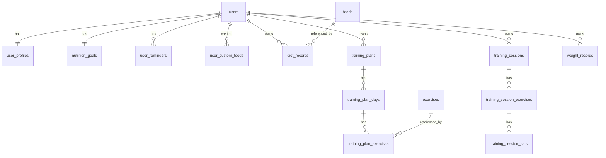

# 健身与饮食记录小程序完整文档汇总


---

# 健身与饮食记录小程序 PRD

> 版本：v1.0  
> 产品形态：微信小程序优先，uni-app 多端兼容架构  
> 技术栈：uni-app + Vue3 + FastAPI + MySQL  
> 第一阶段定位：接近正式商业产品的 MVP，可上线验证用户真实使用需求

---

## 1. 产品概述

### 1.1 产品名称

健身与饮食记录微信小程序。

### 1.2 产品定位

面向健身、减脂、增肌、塑形用户的个人饮食与训练记录工具。产品通过饮食记录、训练计划、训练执行、体重记录、数据统计形成健康管理闭环。

核心闭环：

```text
基础信息填写 → 目标生成/设置 → 饮食记录 → 训练记录 → 体重记录 → 数据反馈 → 目标调整提醒
```

### 1.3 用户群体

| 用户类型 | 典型需求 |
|---|---|
| 减脂用户 | 控制热量摄入，记录体重变化，查看趋势 |
| 增肌用户 | 记录蛋白质摄入、训练重量、训练容量 |
| 健身新手 | 使用训练模板，降低计划制定门槛 |
| 规律训练用户 | 自定义训练计划，记录每组重量和次数 |
| 饮食管理用户 | 记录每日三餐及营养摄入 |

### 1.4 产品目标

第一版需要实现以下目标：

1. 用户可以完成微信静默登录。
2. 用户可以填写基础身体信息，并生成初始饮食目标。
3. 用户可以记录每日饮食，并自动计算热量、碳水、蛋白质、脂肪。
4. 用户可以通过搜索食物、自定义食物、拍照识别流程添加饮食。
5. 用户可以创建训练计划，支持自定义和模板创建。
6. 用户可以在训练执行页记录每组重量、次数和完成状态。
7. 用户完成一组后可以自动触发组间休息倒计时。
8. 用户可以记录体重并查看趋势。
9. 首页展示今日饮食、训练、体重目标进度。
10. 数据页展示饮食、训练、体重的基础统计。
11. 后端预留会员、导出、真实 AI 识别、管理后台等扩展能力。

---

## 2. 产品范围

### 2.1 第一阶段必须实现

| 模块 | 必须实现内容 |
|---|---|
| 用户体系 | 微信静默登录、用户基础资料、隐私协议确认 |
| 首页 | 今日饮食进度、今日训练计划、体重目标进度 |
| 饮食记录 | 餐次记录、搜索食物、自定义食物、营养计算、历史编辑 |
| 拍照识别 | 上传图片、模拟识别返回候选食物、用户确认食物、手动填写重量 |
| 训练计划 | 自定义计划、模板创建、顺序循环、按周排期 |
| 训练执行 | 动作组记录、重量、次数、完成状态、组间倒计时 |
| 训练历史 | 保存完整训练记录、训练时长、动作组详情 |
| 体重记录 | 添加体重、趋势查看、目标体重差距 |
| 数据统计 | 7/30/90 天饮食、训练、体重趋势 |
| 我的 | 资料、目标、提醒设置、账号与数据入口 |
| 合规 | 用户协议、隐私政策、注销账号、删除个人数据入口 |

### 2.2 第一阶段预留但不完整实现

| 功能 | 处理方式 |
|---|---|
| 真实 AI 食物识别 | 先用模拟接口，接口结构保持可替换 |
| 会员付费 | 数据库字段预留，不做支付闭环 |
| 数据导出 | 我的页面预留入口，后续支持 CSV/Excel |
| 管理后台 | 暂不开发页面，基础数据通过初始化脚本导入 |
| 微信订阅消息 | 暂不作为 MVP，训练倒计时只做小程序内提醒 |
| 多单位换算 | 第一版只做克和份数 |
| 自动估算食物重量 | 不做，用户手动填写重量/份数 |
| RPE/力竭等高级训练指标 | 字段可预留备注，不做复杂统计 |

---

## 3. 页面架构

### 3.1 底部导航

底部导航共 5 个一级入口：

1. 首页
2. 饮食
3. 训练
4. 数据
5. 我的

### 3.2 页面结构总览

```text
首页
├── 今日饮食进度卡片
├── 今日训练计划卡片
└── 体重目标进度卡片

饮食
├── 日期切换
├── 早餐/午餐/晚餐/加餐
├── 添加食物
│   ├── 搜索食物
│   ├── 自定义食物
│   └── 拍照识别
└── 饮食记录详情/编辑/删除

训练
├── 今日训练
├── 我的训练计划
├── 创建训练计划
│   ├── 模板创建
│   └── 自定义创建
├── 训练执行页
└── 训练历史

数据
├── 时间筛选：7天/30天/90天
├── 饮食统计
├── 训练统计
└── 体重统计

我的
├── 基础资料
├── 目标设置
├── 提醒设置
├── 账号与数据
└── 用户协议/隐私政策
```

---

## 4. 首页模块

### 4.1 首页定位

首页是每日行动总览页，让用户一进入小程序即可知道今天吃了多少、是否要训练、体重目标进展如何。

### 4.2 今日饮食进度卡片

展示字段：

- 今日已摄入热量 / 目标热量
- 碳水摄入 / 碳水目标
- 蛋白质摄入 / 蛋白质目标
- 脂肪摄入 / 脂肪目标
- 今日餐次记录数量
- 添加饮食按钮

交互：

1. 点击卡片进入饮食页。
2. 点击添加饮食直接打开添加食物入口。
3. 若用户未设置目标，提示“完善目标后可查看完成进度”。

### 4.3 今日训练计划卡片

展示字段：

- 今日训练名称
- 排期方式：顺序循环 / 按周排期
- 动作数量
- 当前状态：未开始 / 进行中 / 已完成 / 今日休息
- 开始训练按钮

交互：

1. 今日有训练时，点击开始训练进入训练执行页。
2. 今日休息时，展示“今日休息”。
3. 无训练计划时，引导创建训练计划。
4. 有未完成训练时，展示“继续训练”。

### 4.4 体重目标进度卡片

展示字段：

- 当前体重
- 目标体重
- 差距
- 最近一次记录时间
- 记录体重按钮

交互：

1. 点击记录体重弹出或进入体重记录页。
2. 点击趋势进入数据页体重统计。

---

## 5. 用户体系与基础资料

### 5.1 登录方式

采用微信静默登录优先。

流程：

```text
打开小程序 → wx.login 获取 code → 后端换取 openid → 创建或查询用户 → 返回 token → 进入小程序
```

首次不强制手机号授权。

手机号授权触发场景：

- 数据找回
- 会员服务
- 客服联系
- 账号安全

### 5.2 首次引导

首次进入需要展示：

1. 用户协议与隐私政策确认。
2. 基础信息填写引导。
3. 初始目标生成。

基础信息可分阶段填写，建议首次填写：

- 性别
- 年龄
- 身高
- 当前体重
- 目标体重
- 健身目标：减脂 / 增肌 / 维持 / 塑形
- 训练频率

---

## 6. 饮食记录模块

### 6.1 业务目标

让用户低成本记录每日饮食，并自动获得热量和三大营养素数据。

### 6.2 饮食记录粒度

采用“餐次 + 时间”结构。

餐次：

- 早餐
- 午餐
- 晚餐
- 加餐

每条记录还需要保存具体时间，方便时间线展示和统计。

### 6.3 饮食添加方式

第一版支持：

1. 搜索系统食物库添加。
2. 添加用户自定义食物。
3. 拍照识别流程添加。

### 6.4 食物库

食物来源：

- 系统内置基础食物库。
- 用户自定义食物库。

食物字段：

- 食物名称
- 分类
- 每 100g 热量
- 每 100g 碳水
- 每 100g 蛋白质
- 每 100g 脂肪
- 默认单位
- 单份重量，可选
- 是否系统内置
- 创建用户 ID

### 6.5 添加食物流程

#### 6.5.1 搜索添加

```text
进入饮食页 → 点击添加食物 → 搜索食物 → 选择食物 → 填写克数/份数 → 确认保存
```

### 6.5.2 自定义食物

```text
添加食物 → 新建自定义食物 → 输入名称和营养数据 → 保存到用户食物库 → 添加到饮食记录
```

### 6.5.3 拍照识别

```text
点击拍照识别 → 拍摄/上传图片 → 后端返回候选食物 → 用户选择食物 → 填写重量/份数 → 选择是否保存图片 → 保存记录
```

识别失败：

- 展示失败提示。
- 引导用户手动搜索添加。

### 6.6 营养计算

克数计算：

```text
实际营养 = 每100g营养值 × 实际克数 / 100
```

份数计算：

```text
实际营养 = 单份营养值 × 份数
```

当日汇总：

```text
今日热量 = 所有饮食记录热量求和
今日碳水 = 所有饮食记录碳水求和
今日蛋白质 = 所有饮食记录蛋白质求和
今日脂肪 = 所有饮食记录脂肪求和
```

### 6.7 饮食记录编辑

用户可以修改和删除任意历史日期的饮食记录。

支持：

- 修改食物重量
- 修改份数
- 修改餐次
- 修改记录时间
- 删除记录
- 补录历史记录

---

## 7. 饮食目标模块

### 7.1 目标内容

每日目标包括：

- 热量 kcal
- 碳水 g
- 蛋白质 g
- 脂肪 g

### 7.2 设置方式

支持：

1. 系统根据基础信息推荐。
2. 用户手动修改。

### 7.3 目标调整提醒

第一版不自动调整用户目标。

当体重变化与目标不匹配时，只提示：

```text
根据近期体重变化，建议重新评估饮食目标。
```

用户点击后进入目标设置页。

---

## 8. 训练模块

### 8.1 训练计划创建

支持：

1. 系统模板创建。
2. 用户完全自定义。

内置模板建议：

- 三分化
- 四分化
- 五分化
- 增肌模板
- 减脂模板

### 8.2 排期方式

支持两种排期：

#### 8.2.1 顺序循环

Day1、Day2、Day3 顺序循环，训练完成后进入下一天。

#### 8.2.2 按周排期

绑定星期几，例如周一胸、周三背、周五腿。

### 8.3 动作库

动作来源：

- 系统内置动作库
- 用户自定义动作

动作分类：

- 胸
- 背
- 肩
- 腿
- 手臂
- 核心
- 有氧
- 其他

### 8.4 训练动作配置

每个动作配置：

- 动作名称
- 部位
- 组数
- 每组次数
- 每组重量
- 默认组间休息时间
- 备注

### 8.5 训练执行

每组记录：

- 重量
- 次数
- 完成状态
- 完成时间

执行流程：

```text
开始训练 → 展示动作列表 → 完成一组 → 自动倒计时 → 继续下一组 → 全部完成 → 结束训练 → 保存历史
```

### 8.6 组间休息倒计时

触发方式：点击“完成本组”后自动开始。

用户可以：

- 暂停
- 跳过
- 手动开始
- 临时调整休息时间
- 关闭自动倒计时

提醒方式：

- 页面提示
- 声音
- 震动

第一版不做微信订阅消息。

### 8.7 训练中断

退出时提示：

1. 保存进度
2. 放弃训练
3. 标记完成

保存进度后，下次进入可继续训练。

### 8.8 训练历史

保存：

- 训练日期
- 计划名称
- 训练日名称
- 开始时间
- 结束时间
- 训练总时长
- 动作详情
- 每组重量
- 每组次数
- 每组完成状态

---

## 9. 体重记录模块

### 9.1 记录字段

- 当前体重
- 记录日期
- 记录时间
- 备注

### 9.2 趋势展示

支持：

- 最近 7 天
- 最近 30 天
- 最近 90 天
- 当前体重与目标体重差距

### 9.3 目标联动

结合体重趋势，提示用户是否需要重新评估饮食目标。

---

## 10. 数据统计模块

### 10.1 时间维度

支持：

- 最近 7 天
- 最近 30 天
- 最近 90 天

### 10.2 饮食统计

- 每日热量趋势
- 碳水趋势
- 蛋白质趋势
- 脂肪趋势
- 目标完成率

### 10.3 训练统计

- 每周训练次数
- 每次训练时长
- 训练容量
- 动作重量变化

训练容量：

```text
训练容量 = 重量 × 次数 × 组数
```

### 10.4 体重统计

- 体重趋势
- 当前体重与目标体重差距
- 7/30/90 天变化

---

## 11. 我的模块

### 11.1 基础资料

- 头像
- 昵称
- 性别
- 年龄
- 身高
- 当前体重
- 目标体重
- 健身目标

### 11.2 目标设置

- 每日热量目标
- 碳水目标
- 蛋白质目标
- 脂肪目标
- 训练频率

### 11.3 提醒设置

- 饮食提醒
- 训练提醒
- 体重提醒

支持开启/关闭和提醒时间设置。

### 11.4 账号与数据

- 手机号授权
- 数据同步状态
- 清除缓存
- 数据导出入口
- 注销账号
- 删除个人数据

第一版数据导出只预留入口。

---

## 12. 隐私与合规

### 12.1 必须提供

- 用户协议
- 隐私政策
- 注销账号
- 删除个人数据
- 图片上传与识别用途说明

### 12.2 图片策略

用户可选择是否保存食物图片。

- 保存：绑定到饮食记录。
- 不保存：仅用于识别流程。

---

## 13. 商业化预留

第一版不做正式付费页面，但预留：

- 会员状态
- 会员到期时间
- 会员权益配置
- 拍照识别次数

后续可商业化功能：

- 高级统计
- 更多训练模板
- 拍照识别次数
- 数据导出
- 个性化饮食建议
- 个性化训练建议

---

## 14. 成功标准

1. 用户可以完成登录和基础信息填写。
2. 用户可以记录饮食并看到营养汇总。
3. 用户可以使用拍照识别流程，即使第一阶段是模拟接口。
4. 用户可以创建并执行训练计划。
5. 用户可以使用组间休息倒计时。
6. 用户可以保存训练历史。
7. 用户可以记录体重并查看趋势。
8. 首页数据能实时反映今日状态。
9. 数据页可以展示 7/30/90 天基础趋势。
10. 数据结构支持后续扩展。


---

# 健身与饮食记录小程序开发文档

> 版本：v1.0  
> 前端：uni-app + Vue3 + Pinia  
> 后端：FastAPI + MySQL  
> 首发平台：微信小程序  
> 目标：让开发人员或 Codex 能直接按模块实现

---

## 1. 总体架构

### 1.1 系统架构

```text
用户微信小程序端
  ↓ HTTPS API
FastAPI 后端服务
  ↓ ORM
MySQL 数据库
  ↓ 可选扩展
对象存储 / AI 识别服务 / Redis / 管理后台
```

### 1.2 前端职责

uni-app 前端负责：

1. 页面展示。
2. 用户交互。
3. 本地缓存。
4. 调用后端 API。
5. 训练倒计时前台执行。
6. 图片选择与上传。
7. 数据图表展示。

### 1.3 后端职责

FastAPI 后端负责：

1. 微信登录换取 openid。
2. 用户认证与 token 管理。
3. 用户资料、目标、提醒设置管理。
4. 食物库、饮食记录管理。
5. 训练计划、训练执行、训练历史管理。
6. 体重记录管理。
7. 数据统计聚合。
8. 图片上传与模拟识别接口。
9. 会员字段、识别次数、数据导出等扩展预留。

### 1.4 数据存储原则

1. MySQL 为核心数据源。
2. 前端本地缓存用于提升体验，不作为最终数据源。
3. 关键写操作必须同步到后端。
4. 允许弱网时前端暂存，后续补偿同步。

---

## 2. 前端开发设计

### 2.1 推荐目录结构

```text
fitness-diet-miniapp/
├── src/
│   ├── api/
│   │   ├── auth.ts
│   │   ├── user.ts
│   │   ├── diet.ts
│   │   ├── food.ts
│   │   ├── training.ts
│   │   ├── weight.ts
│   │   ├── stats.ts
│   │   └── upload.ts
│   ├── components/
│   │   ├── ProgressCard.vue
│   │   ├── MacroProgress.vue
│   │   ├── FoodItem.vue
│   │   ├── ExerciseItem.vue
│   │   ├── RestTimer.vue
│   │   └── EmptyState.vue
│   ├── pages/
│   │   ├── home/
│   │   │   └── index.vue
│   │   ├── diet/
│   │   │   ├── index.vue
│   │   │   ├── add.vue
│   │   │   ├── custom-food.vue
│   │   │   └── photo-recognize.vue
│   │   ├── training/
│   │   │   ├── index.vue
│   │   │   ├── plan-list.vue
│   │   │   ├── plan-edit.vue
│   │   │   ├── execute.vue
│   │   │   └── history.vue
│   │   ├── stats/
│   │   │   └── index.vue
│   │   └── mine/
│   │       ├── index.vue
│   │       ├── profile.vue
│   │       ├── goals.vue
│   │       ├── reminders.vue
│   │       └── privacy.vue
│   ├── store/
│   │   ├── auth.ts
│   │   ├── user.ts
│   │   ├── diet.ts
│   │   ├── training.ts
│   │   └── app.ts
│   ├── utils/
│   │   ├── request.ts
│   │   ├── cache.ts
│   │   ├── date.ts
│   │   ├── nutrition.ts
│   │   └── timer.ts
│   ├── static/
│   ├── App.vue
│   ├── main.ts
│   ├── pages.json
│   └── manifest.json
└── package.json
```

### 2.2 前端页面说明

#### 2.2.1 首页 `pages/home/index.vue`

功能：

- 调用首页聚合接口。
- 展示今日饮食进度。
- 展示今日训练计划。
- 展示体重目标进度。
- 提供添加饮食、开始训练、记录体重快捷入口。

接口：

- `GET /api/v1/home/summary?date=YYYY-MM-DD`

异常状态：

- 未填写基础资料：展示完善资料引导。
- 无训练计划：展示创建训练计划按钮。
- 无饮食目标：展示设置目标按钮。

#### 2.2.2 饮食页 `pages/diet/index.vue`

功能：

- 日期切换。
- 展示早餐/午餐/晚餐/加餐。
- 展示当日营养汇总。
- 添加、编辑、删除饮食记录。

接口：

- `GET /api/v1/diet/records?date=YYYY-MM-DD`
- `DELETE /api/v1/diet/records/{id}`

#### 2.2.3 添加饮食页 `pages/diet/add.vue`

功能：

- 搜索食物。
- 选择食物。
- 填写克数或份数。
- 选择餐次和时间。
- 保存饮食记录。

接口：

- `GET /api/v1/foods/search`
- `POST /api/v1/diet/records`

#### 2.2.4 自定义食物页 `pages/diet/custom-food.vue`

功能：

- 新增用户自定义食物。
- 填写每 100g 热量、碳水、蛋白质、脂肪。
- 保存后可立即用于饮食记录。

接口：

- `POST /api/v1/foods/custom`

#### 2.2.5 拍照识别页 `pages/diet/photo-recognize.vue`

功能：

- 调用相机或相册。
- 上传图片。
- 展示后端返回候选食物。
- 用户选择候选食物。
- 填写重量或份数。
- 选择是否保存图片。
- 保存饮食记录。

接口：

- `POST /api/v1/uploads/image`
- `POST /api/v1/ai/food-recognition`
- `POST /api/v1/diet/records`

#### 2.2.6 训练首页 `pages/training/index.vue`

功能：

- 展示今日训练。
- 展示我的训练计划。
- 展示未完成训练。
- 进入创建计划、开始训练、查看历史。

接口：

- `GET /api/v1/training/today`
- `GET /api/v1/training/plans`

#### 2.2.7 训练计划编辑页 `pages/training/plan-edit.vue`

功能：

- 选择模板或自定义。
- 设置排期方式。
- 添加训练日。
- 添加动作。
- 设置组数、次数、重量、休息时间。

接口：

- `GET /api/v1/training/templates`
- `GET /api/v1/exercises/search`
- `POST /api/v1/training/plans`
- `PUT /api/v1/training/plans/{id}`

#### 2.2.8 训练执行页 `pages/training/execute.vue`

功能：

- 展示动作和组列表。
- 完成一组。
- 自动启动休息倒计时。
- 暂停/跳过/调整倒计时。
- 保存进度/放弃/标记完成。
- 完成训练后生成训练历史。

接口：

- `POST /api/v1/training/sessions`
- `PUT /api/v1/training/sessions/{id}`
- `POST /api/v1/training/sessions/{id}/finish`
- `POST /api/v1/training/sessions/{id}/cancel`

#### 2.2.9 数据页 `pages/stats/index.vue`

功能：

- 7/30/90 天时间切换。
- 饮食趋势图。
- 训练趋势图。
- 体重趋势图。

接口：

- `GET /api/v1/stats/diet?range=7|30|90`
- `GET /api/v1/stats/training?range=7|30|90`
- `GET /api/v1/stats/weight?range=7|30|90`

#### 2.2.10 我的页 `pages/mine/index.vue`

功能：

- 用户资料入口。
- 目标设置入口。
- 提醒设置入口。
- 账号与数据入口。
- 隐私政策入口。

接口：

- `GET /api/v1/users/me`

### 2.3 前端状态管理

#### 2.3.1 auth store

保存：

- token
- openid 状态，不直接暴露 openid
- 登录状态

#### 2.3.2 user store

保存：

- 用户基础资料
- 饮食目标
- 训练频率
- 会员状态

#### 2.3.3 diet store

保存：

- 当前选择日期
- 当日饮食记录
- 当日营养汇总

#### 2.3.4 training store

保存：

- 当前训练计划
- 正在执行的训练 session
- 倒计时状态

### 2.4 请求封装

统一封装 `request.ts`。

要求：

1. 自动携带 token。
2. 401 时清理 token 并重新登录。
3. 统一处理 loading。
4. 统一处理错误提示。
5. 对写操作支持防重复提交。

### 2.5 本地缓存

建议缓存：

- token
- 用户资料
- 最近一次首页摘要
- 食物搜索历史
- 当前未完成训练 session
- 提醒设置

缓存策略：

1. 页面优先读取本地缓存，提高首屏速度。
2. 后台请求成功后更新缓存。
3. 关键写操作必须请求后端成功后才认为保存成功。

---

## 3. 后端开发设计

### 3.1 推荐目录结构

```text
backend/
├── app/
│   ├── main.py
│   ├── core/
│   │   ├── config.py
│   │   ├── security.py
│   │   ├── database.py
│   │   └── exceptions.py
│   ├── api/
│   │   └── v1/
│   │       ├── auth.py
│   │       ├── users.py
│   │       ├── foods.py
│   │       ├── diet.py
│   │       ├── training.py
│   │       ├── exercises.py
│   │       ├── weight.py
│   │       ├── stats.py
│   │       ├── uploads.py
│   │       └── ai.py
│   ├── models/
│   │   ├── user.py
│   │   ├── food.py
│   │   ├── diet.py
│   │   ├── training.py
│   │   ├── exercise.py
│   │   ├── weight.py
│   │   └── system.py
│   ├── schemas/
│   ├── services/
│   ├── repositories/
│   ├── utils/
│   └── seed/
├── migrations/
├── requirements.txt
└── README.md
```

### 3.2 后端模块

| 模块 | 职责 |
|---|---|
| auth | 微信登录、token 签发、手机号授权预留 |
| users | 用户资料、目标、提醒、协议确认 |
| foods | 系统食物库、自定义食物、食物搜索 |
| diet | 饮食记录、营养汇总、编辑删除 |
| ai | 模拟食物识别，后续替换真实 AI |
| uploads | 图片上传、临时图片、长期图片 |
| exercises | 动作库、自定义动作 |
| training | 训练计划、训练执行、训练历史 |
| weight | 体重记录 |
| stats | 饮食、训练、体重统计 |
| system | 枚举、协议、基础配置 |

### 3.3 后端认证

认证方式：Bearer Token。

流程：

```text
前端 wx.login 获取 code
前端调用 /auth/wechat-login
后端换取 openid
后端创建/查询用户
后端签发 access_token
前端后续请求携带 Authorization: Bearer token
```

### 3.4 错误码规范

| code | 含义 |
|---|---|
| 0 | 成功 |
| 40001 | 参数错误 |
| 40101 | 未登录或 token 失效 |
| 40301 | 无权限 |
| 40401 | 资源不存在 |
| 40901 | 数据冲突 |
| 50001 | 服务异常 |
| 60001 | 图片上传失败 |
| 60002 | 食物识别失败 |

统一响应结构：

```json
{
  "code": 0,
  "message": "success",
  "data": {}
}
```

失败示例：

```json
{
  "code": 40001,
  "message": "参数错误：date 不能为空",
  "data": null
}
```

---

## 4. 数据计算规则

### 4.1 饮食营养计算

按克数：

```text
calories = food.calories_per_100g * amount_g / 100
carbs = food.carbs_per_100g * amount_g / 100
protein = food.protein_per_100g * amount_g / 100
fat = food.fat_per_100g * amount_g / 100
```

按份数：

```text
amount_g = serving_weight_g * serving_count
```

若无单份重量，则要求用户手动填写克数。

### 4.2 训练容量计算

单组容量：

```text
volume = weight_kg * reps
```

单动作容量：

```text
exercise_volume = sum(group.volume)
```

单次训练总容量：

```text
session_volume = sum(exercise_volume)
```

### 4.3 首页聚合

首页接口由后端聚合：

- 今日饮食汇总。
- 今日训练状态。
- 最近体重和目标体重。

避免前端多次请求导致首页加载慢。

---

## 5. 图片与 AI 识别实现

### 5.1 图片上传

第一版可先保存到服务器本地目录，接口设计保持对象存储可替换。

保存类型：

- temporary：临时识别图片。
- permanent：用户选择保存的饮食图片。

### 5.2 模拟识别服务

开发阶段返回固定候选：

```json
[
  {"food_id": 1, "name": "米饭", "confidence": 0.92},
  {"food_id": 2, "name": "鸡蛋", "confidence": 0.81},
  {"food_id": 3, "name": "鸡胸肉", "confidence": 0.76}
]
```

后续真实 AI 识别服务只需要替换 service 层，不改变 API 入参和出参。

---

## 6. 开发阶段建议

### 6.1 阶段一：基础框架

- 初始化 uni-app 项目。
- 初始化 FastAPI 项目。
- 配置 MySQL。
- 完成登录、用户资料、首页框架。

### 6.2 阶段二：饮食闭环

- 食物库。
- 饮食记录。
- 自定义食物。
- 营养计算。
- 拍照识别模拟接口。

### 6.3 阶段三：训练闭环

- 动作库。
- 训练模板。
- 训练计划。
- 训练执行。
- 倒计时。
- 训练历史。

### 6.4 阶段四：体重与数据

- 体重记录。
- 数据统计。
- 首页聚合优化。

### 6.5 阶段五：合规与体验

- 用户协议。
- 隐私政策。
- 注销账号。
- 删除数据。
- 异常状态优化。
- 本地缓存优化。

---

## 7. 验收标准

### 7.1 前端验收

1. 五个底部导航页面可正常访问。
2. 登录后 token 正常保存。
3. 首页能展示聚合数据。
4. 饮食添加流程完整。
5. 拍照识别流程可跑通。
6. 训练计划可创建和编辑。
7. 训练执行倒计时可用。
8. 训练中断可保存进度。
9. 数据页可切换 7/30/90 天。
10. 我的页面功能入口完整。

### 7.2 后端验收

1. 所有核心 API 可正常调用。
2. 数据库表结构完整。
3. 用户数据隔离正确。
4. 饮食营养计算准确。
5. 训练历史保存完整。
6. 首页聚合接口返回准确。
7. 删除个人数据可清理用户核心数据。
8. 模拟 AI 识别接口可替换。


---

# Codex 可执行开发任务清单

> 目标：将健身与饮食记录小程序拆解为 Codex/开发人员可逐项执行的任务。  
> 技术栈：uni-app + Vue3 + Pinia + FastAPI + MySQL

---

## 0. 项目初始化

### TASK-0001 初始化前端项目

**目标**：创建 uni-app + Vue3 项目。

**要求**：

1. 使用 TypeScript。
2. 配置微信小程序发行目标。
3. 创建基础目录：api、components、pages、store、utils。
4. 配置 pages.json，包含首页、饮食、训练、数据、我的五个 TabBar。

**验收标准**：

- 项目可以在微信开发者工具运行。
- TabBar 可以正常切换。

---

### TASK-0002 初始化后端项目

**目标**：创建 FastAPI 后端项目。

**要求**：

1. 创建 app 目录结构。
2. 配置 MySQL 连接。
3. 配置 SQLAlchemy。
4. 配置统一响应结构。
5. 配置 CORS。
6. 提供健康检查接口 `/health`。

**验收标准**：

- 后端可启动。
- `/health` 返回正常。

---

### TASK-0003 创建数据库迁移与初始化脚本

**目标**：搭建数据库初始化能力。

**要求**：

1. 创建所有核心表。
2. 编写基础食物、动作、训练模板 seed 脚本。
3. 可重复执行，不重复插入基础数据。

**验收标准**：

- MySQL 中生成完整表结构。
- 基础食物、动作、训练模板可查询。

---

## 1. 用户与认证

### TASK-0101 后端实现微信静默登录接口

**接口**：`POST /api/v1/auth/wechat-login`

**要求**：

1. 接收前端 code。
2. 开发阶段允许 mock openid。
3. 查询或创建用户。
4. 返回 access_token 和用户基础信息。

**验收标准**：

- 新用户首次登录自动创建用户。
- 老用户登录返回原用户信息。

---

### TASK-0102 前端实现登录流程

**要求**：

1. 小程序启动时调用 `uni.login`。
2. 调用后端登录接口。
3. 保存 token。
4. 后续请求自动携带 token。
5. token 失效时重新登录。

**验收标准**：

- 打开小程序后自动登录。
- API 请求 header 中包含 Authorization。

---

### TASK-0103 实现用户资料接口和页面

**接口**：

- `GET /api/v1/users/me`
- `PUT /api/v1/users/me`

**字段**：

- avatar_url
- nickname
- gender
- age
- height_cm
- current_weight_kg
- target_weight_kg
- fitness_goal
- training_frequency

**验收标准**：

- 用户可以查看和修改基础资料。
- 保存后首页和我的页面同步更新。

---

### TASK-0104 实现协议确认

**接口**：`POST /api/v1/users/agreement-confirm`

**要求**：

1. 首次进入展示用户协议和隐私政策。
2. 用户确认后记录确认时间和版本号。

**验收标准**：

- 未确认用户进入时弹窗提示。
- 确认后不再重复弹出。

---

## 2. 首页

### TASK-0201 实现首页聚合接口

**接口**：`GET /api/v1/home/summary?date=YYYY-MM-DD`

**返回内容**：

1. 今日饮食目标和摄入。
2. 今日训练计划状态。
3. 当前体重和目标体重。

**验收标准**：

- 无记录时返回 0 和空状态。
- 有记录时计算结果准确。

---

### TASK-0202 实现首页页面

**要求**：

1. 今日饮食进度卡片。
2. 今日训练计划卡片。
3. 体重目标进度卡片。
4. 快捷跳转按钮。

**验收标准**：

- 首页数据正确展示。
- 点击按钮能跳转对应页面。

---

## 3. 饮食模块

### TASK-0301 实现食物库模型和查询接口

**接口**：

- `GET /api/v1/foods/search?keyword=鸡胸肉`
- `GET /api/v1/foods/{id}`

**要求**：

1. 支持系统食物库。
2. 支持用户自定义食物。
3. 搜索结果包含营养字段。

**验收标准**：

- 可搜索系统食物。
- 用户只看到自己的自定义食物。

---

### TASK-0302 实现自定义食物接口

**接口**：`POST /api/v1/foods/custom`

**要求**：

1. 用户可创建自定义食物。
2. 营养字段必须完整。
3. 创建后可用于饮食记录。

**验收标准**：

- 自定义食物保存成功。
- 搜索结果中可查到。

---

### TASK-0303 实现饮食记录接口

**接口**：

- `GET /api/v1/diet/records?date=YYYY-MM-DD`
- `POST /api/v1/diet/records`
- `PUT /api/v1/diet/records/{id}`
- `DELETE /api/v1/diet/records/{id}`

**要求**：

1. 支持早餐、午餐、晚餐、加餐。
2. 支持克数和份数。
3. 后端计算热量和三大营养素。
4. 支持历史日期编辑。

**验收标准**：

- 添加记录后当日汇总准确。
- 修改记录后汇总更新。
- 删除记录后汇总更新。

---

### TASK-0304 实现饮食页

**要求**：

1. 日期切换。
2. 餐次分组展示。
3. 每条记录展示食物、重量、热量、三大营养素。
4. 支持编辑和删除。

**验收标准**：

- 不同日期数据隔离正确。
- 餐次分组正确。

---

### TASK-0305 实现添加食物页

**要求**：

1. 搜索食物。
2. 选择食物。
3. 输入克数或份数。
4. 选择餐次和时间。
5. 保存记录。

**验收标准**：

- 添加后返回饮食页并刷新数据。

---

### TASK-0306 实现拍照识别流程

**接口**：

- `POST /api/v1/uploads/image`
- `POST /api/v1/ai/food-recognition`

**要求**：

1. 前端支持拍照/相册选择。
2. 后端保存临时图片。
3. 模拟返回候选食物。
4. 用户确认候选并填写重量。
5. 支持是否保存图片。

**验收标准**：

- 整个拍照添加饮食流程可跑通。
- 识别失败时可手动添加。

---

## 4. 饮食目标

### TASK-0401 实现饮食目标接口

**接口**：

- `GET /api/v1/users/nutrition-goal`
- `PUT /api/v1/users/nutrition-goal`
- `POST /api/v1/users/nutrition-goal/recommend`

**要求**：

1. 支持用户手动设置。
2. 支持系统根据基础信息推荐。
3. 目标包括热量、碳水、蛋白质、脂肪。

**验收标准**：

- 推荐接口返回合理默认值。
- 用户可手动修改目标。

---

## 5. 训练模块

### TASK-0501 实现动作库接口

**接口**：

- `GET /api/v1/exercises/search`
- `POST /api/v1/exercises/custom`

**要求**：

1. 支持系统动作库。
2. 支持用户自定义动作。
3. 按部位分类。

**验收标准**：

- 可搜索卧推、深蹲等系统动作。
- 用户可新增自定义动作。

---

### TASK-0502 实现训练模板接口

**接口**：`GET /api/v1/training/templates`

**要求**：

1. 返回三分化、四分化、五分化等模板。
2. 模板包含训练日、动作、组数、次数、重量、休息时间。

**验收标准**：

- 前端可以基于模板创建训练计划。

---

### TASK-0503 实现训练计划接口

**接口**：

- `GET /api/v1/training/plans`
- `POST /api/v1/training/plans`
- `GET /api/v1/training/plans/{id}`
- `PUT /api/v1/training/plans/{id}`
- `DELETE /api/v1/training/plans/{id}`

**要求**：

1. 支持顺序循环和按周排期。
2. 支持训练日。
3. 支持训练动作和组配置。
4. 支持默认休息时间。

**验收标准**：

- 用户可以创建完整训练计划。
- 训练计划详情能完整回显。

---

### TASK-0504 实现训练计划页面

**要求**：

1. 我的计划列表。
2. 创建计划。
3. 选择模板。
4. 编辑训练日和动作。
5. 保存计划。

**验收标准**：

- 模板创建和自定义创建都可用。

---

### TASK-0505 实现今日训练接口

**接口**：`GET /api/v1/training/today?date=YYYY-MM-DD`

**要求**：

1. 根据顺序循环或按周排期计算今日训练。
2. 返回今日是否训练、训练日名称、动作列表。
3. 返回是否存在未完成 session。

**验收标准**：

- 周排期能按星期返回正确训练。
- 顺序循环能按进度返回正确训练日。

---

### TASK-0506 实现训练 session 接口

**接口**：

- `POST /api/v1/training/sessions`
- `GET /api/v1/training/sessions/{id}`
- `PUT /api/v1/training/sessions/{id}`
- `POST /api/v1/training/sessions/{id}/finish`
- `POST /api/v1/training/sessions/{id}/cancel`

**要求**：

1. 创建训练 session。
2. 保存每组完成状态。
3. 支持保存进度。
4. 支持完成训练。
5. 支持放弃训练。

**验收标准**：

- 中断后可以继续。
- 完成后生成训练历史。

---

### TASK-0507 实现训练执行页和倒计时

**要求**：

1. 展示动作和组。
2. 完成一组后自动开始倒计时。
3. 支持暂停、跳过、调整时间。
4. 倒计时结束震动和声音提醒。
5. 退出时提示保存进度/放弃/标记完成。

**验收标准**：

- 倒计时准确。
- 页面切换后能恢复当前 session。

---

## 6. 体重模块

### TASK-0601 实现体重记录接口

**接口**：

- `GET /api/v1/weight/records?range=30`
- `POST /api/v1/weight/records`
- `PUT /api/v1/weight/records/{id}`
- `DELETE /api/v1/weight/records/{id}`

**要求**：

1. 支持添加体重。
2. 支持历史记录编辑和删除。
3. 支持按时间范围查询。

**验收标准**：

- 体重记录可正常增删改查。

---

### TASK-0602 实现体重记录页面/弹窗

**要求**：

1. 输入体重。
2. 选择记录时间。
3. 可填写备注。
4. 保存后刷新首页和数据页。

**验收标准**：

- 首页体重卡片能更新。

---

## 7. 数据统计

### TASK-0701 实现饮食统计接口

**接口**：`GET /api/v1/stats/diet?range=7|30|90`

**返回**：

- 日期
- 热量
- 碳水
- 蛋白质
- 脂肪
- 目标完成率

**验收标准**：

- 返回连续日期，缺失日期填 0。

---

### TASK-0702 实现训练统计接口

**接口**：`GET /api/v1/stats/training?range=7|30|90`

**返回**：

- 日期
- 训练次数
- 训练时长
- 训练容量
- 动作重量变化

**验收标准**：

- 训练容量计算准确。

---

### TASK-0703 实现体重统计接口

**接口**：`GET /api/v1/stats/weight?range=7|30|90`

**返回**：

- 日期
- 体重
- 与目标差距
- 阶段变化

**验收标准**：

- 趋势数据正确。

---

### TASK-0704 实现数据页

**要求**：

1. 支持 7/30/90 天切换。
2. 展示饮食统计。
3. 展示训练统计。
4. 展示体重统计。

**验收标准**：

- 时间切换后图表刷新。

---

## 8. 我的模块

### TASK-0801 实现我的页面

**要求**：

1. 展示用户头像昵称。
2. 提供资料、目标、提醒、账号数据、隐私政策入口。

**验收标准**：

- 所有入口可访问。

---

### TASK-0802 实现提醒设置

**接口**：

- `GET /api/v1/users/reminders`
- `PUT /api/v1/users/reminders`

**要求**：

1. 饮食提醒。
2. 训练提醒。
3. 体重提醒。
4. 开启/关闭和时间设置。

**验收标准**：

- 设置可保存和回显。

---

### TASK-0803 实现注销账号与删除数据接口

**接口**：

- `POST /api/v1/users/delete-data`
- `POST /api/v1/users/cancel-account`

**要求**：

1. 删除用户饮食、训练、体重等个人数据。
2. 注销账号时标记用户状态为 cancelled。
3. 不物理删除系统基础数据。

**验收标准**：

- 删除后用户数据不可查询。

---

## 9. 测试与验收

### TASK-0901 编写后端单元测试

覆盖：

- 登录
- 食物搜索
- 饮食记录计算
- 训练 session
- 体重记录
- 统计接口

### TASK-0902 编写前端核心流程测试用例

覆盖：

- 首次进入
- 添加饮食
- 拍照识别
- 创建训练计划
- 执行训练
- 体重记录
- 数据统计

### TASK-0903 联调验收

要求：

1. 完成一条完整用户路径。
2. 所有写入数据都能在 MySQL 查询到。
3. 首页、数据页统计一致。

---

## 10. 推荐开发顺序

```text
项目初始化
→ 登录与用户资料
→ 首页框架
→ 食物库与饮食记录
→ 拍照识别模拟接口
→ 训练动作库与模板
→ 训练计划
→ 训练执行与倒计时
→ 体重记录
→ 数据统计
→ 我的页面与合规
→ 联调测试
```


---

# 数据库表结构设计

> 数据库：MySQL 8.x  
> 字符集：utf8mb4  
> 存储引擎：InnoDB  
> 说明：字段设计已预留会员、AI 识别、数据导出、管理后台扩展能力。

---

## 1. 命名规范

1. 表名使用小写蛇形命名。
2. 主键统一使用 `id BIGINT AUTO_INCREMENT`。
3. 所有业务表包含 `created_at`、`updated_at`。
4. 需要软删除的表包含 `deleted_at`。
5. 金额、重量、营养值使用 `DECIMAL`，避免浮点误差。
6. 枚举字段使用 `VARCHAR`，便于扩展。

---

## 2. 核心 ER 关系



---

## 3. 用户相关表

### 3.1 users

用户主表。

```sql
CREATE TABLE users (
    id BIGINT PRIMARY KEY AUTO_INCREMENT,
    openid VARCHAR(128) NOT NULL UNIQUE,
    unionid VARCHAR(128) NULL,
    phone VARCHAR(32) NULL,
    nickname VARCHAR(100) NULL,
    avatar_url VARCHAR(500) NULL,
    status VARCHAR(32) NOT NULL DEFAULT 'active',
    is_member TINYINT NOT NULL DEFAULT 0,
    member_expired_at DATETIME NULL,
    membership_level VARCHAR(32) NULL,
    photo_recognition_count INT NOT NULL DEFAULT 0,
    last_login_at DATETIME NULL,
    agreement_version VARCHAR(32) NULL,
    agreement_confirmed_at DATETIME NULL,
    created_at DATETIME NOT NULL DEFAULT CURRENT_TIMESTAMP,
    updated_at DATETIME NOT NULL DEFAULT CURRENT_TIMESTAMP ON UPDATE CURRENT_TIMESTAMP,
    deleted_at DATETIME NULL,
    INDEX idx_users_phone (phone),
    INDEX idx_users_status (status)
) ENGINE=InnoDB DEFAULT CHARSET=utf8mb4;
```

### 3.2 user_profiles

用户基础身体信息。

```sql
CREATE TABLE user_profiles (
    id BIGINT PRIMARY KEY AUTO_INCREMENT,
    user_id BIGINT NOT NULL UNIQUE,
    gender VARCHAR(16) NULL,
    age INT NULL,
    height_cm DECIMAL(6,2) NULL,
    current_weight_kg DECIMAL(6,2) NULL,
    target_weight_kg DECIMAL(6,2) NULL,
    fitness_goal VARCHAR(32) NULL,
    training_frequency VARCHAR(32) NULL,
    created_at DATETIME NOT NULL DEFAULT CURRENT_TIMESTAMP,
    updated_at DATETIME NOT NULL DEFAULT CURRENT_TIMESTAMP ON UPDATE CURRENT_TIMESTAMP,
    CONSTRAINT fk_user_profiles_user FOREIGN KEY (user_id) REFERENCES users(id)
) ENGINE=InnoDB DEFAULT CHARSET=utf8mb4;
```

### 3.3 nutrition_goals

用户每日营养目标。

```sql
CREATE TABLE nutrition_goals (
    id BIGINT PRIMARY KEY AUTO_INCREMENT,
    user_id BIGINT NOT NULL UNIQUE,
    calories_kcal DECIMAL(8,2) NOT NULL DEFAULT 0,
    carbs_g DECIMAL(8,2) NOT NULL DEFAULT 0,
    protein_g DECIMAL(8,2) NOT NULL DEFAULT 0,
    fat_g DECIMAL(8,2) NOT NULL DEFAULT 0,
    source VARCHAR(32) NOT NULL DEFAULT 'manual',
    created_at DATETIME NOT NULL DEFAULT CURRENT_TIMESTAMP,
    updated_at DATETIME NOT NULL DEFAULT CURRENT_TIMESTAMP ON UPDATE CURRENT_TIMESTAMP,
    CONSTRAINT fk_nutrition_goals_user FOREIGN KEY (user_id) REFERENCES users(id)
) ENGINE=InnoDB DEFAULT CHARSET=utf8mb4;
```

### 3.4 user_reminders

用户提醒设置。

```sql
CREATE TABLE user_reminders (
    id BIGINT PRIMARY KEY AUTO_INCREMENT,
    user_id BIGINT NOT NULL,
    reminder_type VARCHAR(32) NOT NULL,
    enabled TINYINT NOT NULL DEFAULT 0,
    reminder_time TIME NULL,
    weekdays VARCHAR(32) NULL,
    created_at DATETIME NOT NULL DEFAULT CURRENT_TIMESTAMP,
    updated_at DATETIME NOT NULL DEFAULT CURRENT_TIMESTAMP ON UPDATE CURRENT_TIMESTAMP,
    UNIQUE KEY uk_user_reminder_type (user_id, reminder_type),
    CONSTRAINT fk_user_reminders_user FOREIGN KEY (user_id) REFERENCES users(id)
) ENGINE=InnoDB DEFAULT CHARSET=utf8mb4;
```

---

## 4. 食物与饮食表

### 4.1 foods

系统食物库。

```sql
CREATE TABLE foods (
    id BIGINT PRIMARY KEY AUTO_INCREMENT,
    name VARCHAR(100) NOT NULL,
    category VARCHAR(64) NULL,
    calories_per_100g DECIMAL(8,2) NOT NULL DEFAULT 0,
    carbs_per_100g DECIMAL(8,2) NOT NULL DEFAULT 0,
    protein_per_100g DECIMAL(8,2) NOT NULL DEFAULT 0,
    fat_per_100g DECIMAL(8,2) NOT NULL DEFAULT 0,
    default_unit VARCHAR(16) NOT NULL DEFAULT 'g',
    serving_weight_g DECIMAL(8,2) NULL,
    is_system TINYINT NOT NULL DEFAULT 1,
    status VARCHAR(32) NOT NULL DEFAULT 'active',
    created_at DATETIME NOT NULL DEFAULT CURRENT_TIMESTAMP,
    updated_at DATETIME NOT NULL DEFAULT CURRENT_TIMESTAMP ON UPDATE CURRENT_TIMESTAMP,
    INDEX idx_foods_name (name),
    INDEX idx_foods_category (category)
) ENGINE=InnoDB DEFAULT CHARSET=utf8mb4;
```

### 4.2 user_custom_foods

用户自定义食物。

```sql
CREATE TABLE user_custom_foods (
    id BIGINT PRIMARY KEY AUTO_INCREMENT,
    user_id BIGINT NOT NULL,
    name VARCHAR(100) NOT NULL,
    category VARCHAR(64) NULL,
    calories_per_100g DECIMAL(8,2) NOT NULL DEFAULT 0,
    carbs_per_100g DECIMAL(8,2) NOT NULL DEFAULT 0,
    protein_per_100g DECIMAL(8,2) NOT NULL DEFAULT 0,
    fat_per_100g DECIMAL(8,2) NOT NULL DEFAULT 0,
    default_unit VARCHAR(16) NOT NULL DEFAULT 'g',
    serving_weight_g DECIMAL(8,2) NULL,
    status VARCHAR(32) NOT NULL DEFAULT 'active',
    created_at DATETIME NOT NULL DEFAULT CURRENT_TIMESTAMP,
    updated_at DATETIME NOT NULL DEFAULT CURRENT_TIMESTAMP ON UPDATE CURRENT_TIMESTAMP,
    deleted_at DATETIME NULL,
    INDEX idx_custom_foods_user_name (user_id, name),
    CONSTRAINT fk_custom_foods_user FOREIGN KEY (user_id) REFERENCES users(id)
) ENGINE=InnoDB DEFAULT CHARSET=utf8mb4;
```

### 4.3 diet_records

饮食记录。

```sql
CREATE TABLE diet_records (
    id BIGINT PRIMARY KEY AUTO_INCREMENT,
    user_id BIGINT NOT NULL,
    record_date DATE NOT NULL,
    record_time TIME NOT NULL,
    meal_type VARCHAR(32) NOT NULL,
    food_source VARCHAR(32) NOT NULL,
    food_id BIGINT NULL,
    custom_food_id BIGINT NULL,
    food_name_snapshot VARCHAR(100) NOT NULL,
    unit_type VARCHAR(16) NOT NULL,
    amount_g DECIMAL(8,2) NULL,
    serving_count DECIMAL(8,2) NULL,
    image_url VARCHAR(500) NULL,
    save_image TINYINT NOT NULL DEFAULT 0,
    calories_kcal DECIMAL(8,2) NOT NULL DEFAULT 0,
    carbs_g DECIMAL(8,2) NOT NULL DEFAULT 0,
    protein_g DECIMAL(8,2) NOT NULL DEFAULT 0,
    fat_g DECIMAL(8,2) NOT NULL DEFAULT 0,
    note VARCHAR(500) NULL,
    created_at DATETIME NOT NULL DEFAULT CURRENT_TIMESTAMP,
    updated_at DATETIME NOT NULL DEFAULT CURRENT_TIMESTAMP ON UPDATE CURRENT_TIMESTAMP,
    deleted_at DATETIME NULL,
    INDEX idx_diet_user_date (user_id, record_date),
    INDEX idx_diet_user_meal (user_id, meal_type),
    CONSTRAINT fk_diet_records_user FOREIGN KEY (user_id) REFERENCES users(id)
) ENGINE=InnoDB DEFAULT CHARSET=utf8mb4;
```

### 4.4 food_recognition_logs

食物识别记录。

```sql
CREATE TABLE food_recognition_logs (
    id BIGINT PRIMARY KEY AUTO_INCREMENT,
    user_id BIGINT NOT NULL,
    image_url VARCHAR(500) NOT NULL,
    recognition_status VARCHAR(32) NOT NULL DEFAULT 'success',
    candidates_json JSON NULL,
    selected_food_id BIGINT NULL,
    selected_custom_food_id BIGINT NULL,
    provider VARCHAR(64) NOT NULL DEFAULT 'mock',
    error_message VARCHAR(500) NULL,
    created_at DATETIME NOT NULL DEFAULT CURRENT_TIMESTAMP,
    INDEX idx_recognition_user_created (user_id, created_at),
    CONSTRAINT fk_food_recognition_user FOREIGN KEY (user_id) REFERENCES users(id)
) ENGINE=InnoDB DEFAULT CHARSET=utf8mb4;
```

---

## 5. 动作与训练计划表

### 5.1 exercises

系统动作库。

```sql
CREATE TABLE exercises (
    id BIGINT PRIMARY KEY AUTO_INCREMENT,
    name VARCHAR(100) NOT NULL,
    body_part VARCHAR(64) NOT NULL,
    description VARCHAR(1000) NULL,
    is_system TINYINT NOT NULL DEFAULT 1,
    status VARCHAR(32) NOT NULL DEFAULT 'active',
    created_at DATETIME NOT NULL DEFAULT CURRENT_TIMESTAMP,
    updated_at DATETIME NOT NULL DEFAULT CURRENT_TIMESTAMP ON UPDATE CURRENT_TIMESTAMP,
    INDEX idx_exercises_name (name),
    INDEX idx_exercises_body_part (body_part)
) ENGINE=InnoDB DEFAULT CHARSET=utf8mb4;
```

### 5.2 user_custom_exercises

用户自定义动作。

```sql
CREATE TABLE user_custom_exercises (
    id BIGINT PRIMARY KEY AUTO_INCREMENT,
    user_id BIGINT NOT NULL,
    name VARCHAR(100) NOT NULL,
    body_part VARCHAR(64) NOT NULL,
    description VARCHAR(1000) NULL,
    status VARCHAR(32) NOT NULL DEFAULT 'active',
    created_at DATETIME NOT NULL DEFAULT CURRENT_TIMESTAMP,
    updated_at DATETIME NOT NULL DEFAULT CURRENT_TIMESTAMP ON UPDATE CURRENT_TIMESTAMP,
    deleted_at DATETIME NULL,
    INDEX idx_user_custom_exercises (user_id, name),
    CONSTRAINT fk_custom_exercises_user FOREIGN KEY (user_id) REFERENCES users(id)
) ENGINE=InnoDB DEFAULT CHARSET=utf8mb4;
```

### 5.3 training_templates

训练模板。

```sql
CREATE TABLE training_templates (
    id BIGINT PRIMARY KEY AUTO_INCREMENT,
    name VARCHAR(100) NOT NULL,
    description VARCHAR(1000) NULL,
    split_type VARCHAR(32) NOT NULL,
    difficulty VARCHAR(32) NULL,
    goal VARCHAR(32) NULL,
    status VARCHAR(32) NOT NULL DEFAULT 'active',
    created_at DATETIME NOT NULL DEFAULT CURRENT_TIMESTAMP,
    updated_at DATETIME NOT NULL DEFAULT CURRENT_TIMESTAMP ON UPDATE CURRENT_TIMESTAMP
) ENGINE=InnoDB DEFAULT CHARSET=utf8mb4;
```

### 5.4 training_template_days

模板训练日。

```sql
CREATE TABLE training_template_days (
    id BIGINT PRIMARY KEY AUTO_INCREMENT,
    template_id BIGINT NOT NULL,
    day_index INT NOT NULL,
    day_name VARCHAR(100) NOT NULL,
    is_rest_day TINYINT NOT NULL DEFAULT 0,
    weekday INT NULL,
    created_at DATETIME NOT NULL DEFAULT CURRENT_TIMESTAMP,
    CONSTRAINT fk_template_days_template FOREIGN KEY (template_id) REFERENCES training_templates(id)
) ENGINE=InnoDB DEFAULT CHARSET=utf8mb4;
```

### 5.5 training_template_exercises

模板训练动作。

```sql
CREATE TABLE training_template_exercises (
    id BIGINT PRIMARY KEY AUTO_INCREMENT,
    template_day_id BIGINT NOT NULL,
    exercise_id BIGINT NOT NULL,
    sort_order INT NOT NULL DEFAULT 0,
    target_sets INT NOT NULL DEFAULT 4,
    target_reps INT NOT NULL DEFAULT 10,
    target_weight_kg DECIMAL(8,2) NULL,
    rest_seconds INT NOT NULL DEFAULT 90,
    note VARCHAR(500) NULL,
    created_at DATETIME NOT NULL DEFAULT CURRENT_TIMESTAMP,
    CONSTRAINT fk_template_exercises_day FOREIGN KEY (template_day_id) REFERENCES training_template_days(id),
    CONSTRAINT fk_template_exercises_exercise FOREIGN KEY (exercise_id) REFERENCES exercises(id)
) ENGINE=InnoDB DEFAULT CHARSET=utf8mb4;
```

### 5.6 training_plans

用户训练计划。

```sql
CREATE TABLE training_plans (
    id BIGINT PRIMARY KEY AUTO_INCREMENT,
    user_id BIGINT NOT NULL,
    name VARCHAR(100) NOT NULL,
    schedule_type VARCHAR(32) NOT NULL,
    source_template_id BIGINT NULL,
    current_day_index INT NOT NULL DEFAULT 1,
    is_active TINYINT NOT NULL DEFAULT 1,
    status VARCHAR(32) NOT NULL DEFAULT 'active',
    created_at DATETIME NOT NULL DEFAULT CURRENT_TIMESTAMP,
    updated_at DATETIME NOT NULL DEFAULT CURRENT_TIMESTAMP ON UPDATE CURRENT_TIMESTAMP,
    deleted_at DATETIME NULL,
    INDEX idx_training_plans_user (user_id),
    CONSTRAINT fk_training_plans_user FOREIGN KEY (user_id) REFERENCES users(id)
) ENGINE=InnoDB DEFAULT CHARSET=utf8mb4;
```

### 5.7 training_plan_days

用户训练计划日。

```sql
CREATE TABLE training_plan_days (
    id BIGINT PRIMARY KEY AUTO_INCREMENT,
    plan_id BIGINT NOT NULL,
    day_index INT NOT NULL,
    day_name VARCHAR(100) NOT NULL,
    is_rest_day TINYINT NOT NULL DEFAULT 0,
    weekday INT NULL,
    sort_order INT NOT NULL DEFAULT 0,
    created_at DATETIME NOT NULL DEFAULT CURRENT_TIMESTAMP,
    updated_at DATETIME NOT NULL DEFAULT CURRENT_TIMESTAMP ON UPDATE CURRENT_TIMESTAMP,
    CONSTRAINT fk_training_plan_days_plan FOREIGN KEY (plan_id) REFERENCES training_plans(id)
) ENGINE=InnoDB DEFAULT CHARSET=utf8mb4;
```

### 5.8 training_plan_exercises

用户训练计划动作。

```sql
CREATE TABLE training_plan_exercises (
    id BIGINT PRIMARY KEY AUTO_INCREMENT,
    plan_day_id BIGINT NOT NULL,
    exercise_source VARCHAR(32) NOT NULL,
    exercise_id BIGINT NULL,
    custom_exercise_id BIGINT NULL,
    exercise_name_snapshot VARCHAR(100) NOT NULL,
    body_part_snapshot VARCHAR(64) NULL,
    sort_order INT NOT NULL DEFAULT 0,
    target_sets INT NOT NULL DEFAULT 4,
    target_reps INT NOT NULL DEFAULT 10,
    target_weight_kg DECIMAL(8,2) NULL,
    rest_seconds INT NOT NULL DEFAULT 90,
    note VARCHAR(500) NULL,
    created_at DATETIME NOT NULL DEFAULT CURRENT_TIMESTAMP,
    updated_at DATETIME NOT NULL DEFAULT CURRENT_TIMESTAMP ON UPDATE CURRENT_TIMESTAMP,
    CONSTRAINT fk_training_plan_exercises_day FOREIGN KEY (plan_day_id) REFERENCES training_plan_days(id)
) ENGINE=InnoDB DEFAULT CHARSET=utf8mb4;
```

---

## 6. 训练执行与历史表

### 6.1 training_sessions

训练 session。

```sql
CREATE TABLE training_sessions (
    id BIGINT PRIMARY KEY AUTO_INCREMENT,
    user_id BIGINT NOT NULL,
    plan_id BIGINT NULL,
    plan_day_id BIGINT NULL,
    session_date DATE NOT NULL,
    session_name VARCHAR(100) NOT NULL,
    status VARCHAR(32) NOT NULL DEFAULT 'in_progress',
    started_at DATETIME NOT NULL,
    ended_at DATETIME NULL,
    duration_seconds INT NOT NULL DEFAULT 0,
    total_volume DECIMAL(12,2) NOT NULL DEFAULT 0,
    note VARCHAR(1000) NULL,
    created_at DATETIME NOT NULL DEFAULT CURRENT_TIMESTAMP,
    updated_at DATETIME NOT NULL DEFAULT CURRENT_TIMESTAMP ON UPDATE CURRENT_TIMESTAMP,
    deleted_at DATETIME NULL,
    INDEX idx_training_sessions_user_date (user_id, session_date),
    INDEX idx_training_sessions_status (user_id, status),
    CONSTRAINT fk_training_sessions_user FOREIGN KEY (user_id) REFERENCES users(id)
) ENGINE=InnoDB DEFAULT CHARSET=utf8mb4;
```

### 6.2 training_session_exercises

训练 session 动作。

```sql
CREATE TABLE training_session_exercises (
    id BIGINT PRIMARY KEY AUTO_INCREMENT,
    session_id BIGINT NOT NULL,
    exercise_name_snapshot VARCHAR(100) NOT NULL,
    body_part_snapshot VARCHAR(64) NULL,
    sort_order INT NOT NULL DEFAULT 0,
    planned_sets INT NOT NULL DEFAULT 0,
    completed_sets INT NOT NULL DEFAULT 0,
    rest_seconds INT NOT NULL DEFAULT 90,
    note VARCHAR(500) NULL,
    created_at DATETIME NOT NULL DEFAULT CURRENT_TIMESTAMP,
    updated_at DATETIME NOT NULL DEFAULT CURRENT_TIMESTAMP ON UPDATE CURRENT_TIMESTAMP,
    CONSTRAINT fk_session_exercises_session FOREIGN KEY (session_id) REFERENCES training_sessions(id)
) ENGINE=InnoDB DEFAULT CHARSET=utf8mb4;
```

### 6.3 training_session_sets

训练 session 组记录。

```sql
CREATE TABLE training_session_sets (
    id BIGINT PRIMARY KEY AUTO_INCREMENT,
    session_exercise_id BIGINT NOT NULL,
    set_index INT NOT NULL,
    target_reps INT NULL,
    target_weight_kg DECIMAL(8,2) NULL,
    actual_reps INT NULL,
    actual_weight_kg DECIMAL(8,2) NULL,
    completed TINYINT NOT NULL DEFAULT 0,
    completed_at DATETIME NULL,
    volume DECIMAL(12,2) NOT NULL DEFAULT 0,
    note VARCHAR(500) NULL,
    created_at DATETIME NOT NULL DEFAULT CURRENT_TIMESTAMP,
    updated_at DATETIME NOT NULL DEFAULT CURRENT_TIMESTAMP ON UPDATE CURRENT_TIMESTAMP,
    CONSTRAINT fk_session_sets_exercise FOREIGN KEY (session_exercise_id) REFERENCES training_session_exercises(id)
) ENGINE=InnoDB DEFAULT CHARSET=utf8mb4;
```

---

## 7. 体重表

### 7.1 weight_records

```sql
CREATE TABLE weight_records (
    id BIGINT PRIMARY KEY AUTO_INCREMENT,
    user_id BIGINT NOT NULL,
    record_date DATE NOT NULL,
    record_time TIME NOT NULL,
    weight_kg DECIMAL(6,2) NOT NULL,
    note VARCHAR(500) NULL,
    created_at DATETIME NOT NULL DEFAULT CURRENT_TIMESTAMP,
    updated_at DATETIME NOT NULL DEFAULT CURRENT_TIMESTAMP ON UPDATE CURRENT_TIMESTAMP,
    deleted_at DATETIME NULL,
    INDEX idx_weight_user_date (user_id, record_date),
    CONSTRAINT fk_weight_records_user FOREIGN KEY (user_id) REFERENCES users(id)
) ENGINE=InnoDB DEFAULT CHARSET=utf8mb4;
```

---

## 8. 文件表

### 8.1 uploaded_files

```sql
CREATE TABLE uploaded_files (
    id BIGINT PRIMARY KEY AUTO_INCREMENT,
    user_id BIGINT NOT NULL,
    file_type VARCHAR(32) NOT NULL,
    usage_type VARCHAR(32) NOT NULL,
    file_url VARCHAR(500) NOT NULL,
    storage_provider VARCHAR(64) NOT NULL DEFAULT 'local',
    original_name VARCHAR(255) NULL,
    file_size BIGINT NULL,
    mime_type VARCHAR(100) NULL,
    is_temporary TINYINT NOT NULL DEFAULT 1,
    expired_at DATETIME NULL,
    created_at DATETIME NOT NULL DEFAULT CURRENT_TIMESTAMP,
    INDEX idx_uploaded_files_user (user_id, created_at),
    CONSTRAINT fk_uploaded_files_user FOREIGN KEY (user_id) REFERENCES users(id)
) ENGINE=InnoDB DEFAULT CHARSET=utf8mb4;
```

---

## 9. 系统与审计表

### 9.1 operation_logs

```sql
CREATE TABLE operation_logs (
    id BIGINT PRIMARY KEY AUTO_INCREMENT,
    user_id BIGINT NULL,
    action VARCHAR(100) NOT NULL,
    target_type VARCHAR(64) NULL,
    target_id BIGINT NULL,
    ip VARCHAR(64) NULL,
    user_agent VARCHAR(500) NULL,
    detail_json JSON NULL,
    created_at DATETIME NOT NULL DEFAULT CURRENT_TIMESTAMP,
    INDEX idx_operation_logs_user (user_id, created_at),
    INDEX idx_operation_logs_action (action)
) ENGINE=InnoDB DEFAULT CHARSET=utf8mb4;
```

---

## 10. 初始化数据建议

### 10.1 食物库分类

- 主食
- 肉蛋奶
- 蔬菜
- 水果
- 坚果
- 饮品
- 零食
- 其他

### 10.2 动作分类

- 胸
- 背
- 肩
- 腿
- 手臂
- 核心
- 有氧
- 其他

### 10.3 训练模板

建议初始化：

1. 三分化增肌模板。
2. 四分化增肌模板。
3. 五分化增肌模板。
4. 减脂基础模板。
5. 新手全身训练模板。

---

## 11. 字段枚举建议

### 11.1 meal_type

| 值 | 含义 |
|---|---|
| breakfast | 早餐 |
| lunch | 午餐 |
| dinner | 晚餐 |
| snack | 加餐 |

### 11.2 unit_type

| 值 | 含义 |
|---|---|
| g | 克 |
| serving | 份 |

### 11.3 schedule_type

| 值 | 含义 |
|---|---|
| sequence | 顺序循环 |
| weekly | 按周排期 |

### 11.4 session_status

| 值 | 含义 |
|---|---|
| in_progress | 进行中 |
| paused | 已保存进度 |
| completed | 已完成 |
| cancelled | 已放弃 |

### 11.5 fitness_goal

| 值 | 含义 |
|---|---|
| fat_loss | 减脂 |
| muscle_gain | 增肌 |
| maintain | 维持 |
| shaping | 塑形 |


---

# API 接口清单

> Base URL：`/api/v1`  
> 认证方式：`Authorization: Bearer <access_token>`  
> 响应格式：统一 JSON

---

## 1. 通用响应格式

### 1.1 成功响应

```json
{
  "code": 0,
  "message": "success",
  "data": {}
}
```

### 1.2 失败响应

```json
{
  "code": 40001,
  "message": "参数错误",
  "data": null
}
```

### 1.3 通用错误码

| code | 含义 |
|---|---|
| 0 | 成功 |
| 40001 | 参数错误 |
| 40101 | 未登录或 token 失效 |
| 40301 | 无权限 |
| 40401 | 资源不存在 |
| 40901 | 数据冲突 |
| 50001 | 服务异常 |
| 60001 | 图片上传失败 |
| 60002 | 食物识别失败 |

---

## 2. 认证接口

### 2.1 微信静默登录

`POST /auth/wechat-login`

请求：

```json
{
  "code": "wx_login_code"
}
```

响应：

```json
{
  "code": 0,
  "message": "success",
  "data": {
    "access_token": "token",
    "token_type": "Bearer",
    "user": {
      "id": 1,
      "nickname": "用户",
      "avatar_url": "",
      "is_new_user": true,
      "agreement_confirmed": false
    }
  }
}
```

---

## 3. 用户接口

### 3.1 获取当前用户

`GET /users/me`

响应：

```json
{
  "code": 0,
  "message": "success",
  "data": {
    "id": 1,
    "nickname": "用户",
    "avatar_url": "",
    "phone": null,
    "is_member": false,
    "member_expired_at": null,
    "profile": {
      "gender": "male",
      "age": 28,
      "height_cm": 175,
      "current_weight_kg": 70,
      "target_weight_kg": 65,
      "fitness_goal": "fat_loss",
      "training_frequency": "3-4"
    }
  }
}
```

### 3.2 更新用户资料

`PUT /users/me`

请求：

```json
{
  "nickname": "用户昵称",
  "avatar_url": "https://example.com/avatar.png",
  "gender": "male",
  "age": 28,
  "height_cm": 175,
  "current_weight_kg": 70,
  "target_weight_kg": 65,
  "fitness_goal": "fat_loss",
  "training_frequency": "3-4"
}
```

### 3.3 确认协议

`POST /users/agreement-confirm`

请求：

```json
{
  "agreement_version": "v1.0",
  "privacy_version": "v1.0"
}
```

### 3.4 获取营养目标

`GET /users/nutrition-goal`

### 3.5 更新营养目标

`PUT /users/nutrition-goal`

请求：

```json
{
  "calories_kcal": 1800,
  "carbs_g": 180,
  "protein_g": 120,
  "fat_g": 50
}
```

### 3.6 推荐营养目标

`POST /users/nutrition-goal/recommend`

响应：

```json
{
  "code": 0,
  "message": "success",
  "data": {
    "calories_kcal": 1800,
    "carbs_g": 180,
    "protein_g": 120,
    "fat_g": 50,
    "formula_note": "基于基础信息和目标的估算值，可手动调整"
  }
}
```

### 3.7 获取提醒设置

`GET /users/reminders`

### 3.8 更新提醒设置

`PUT /users/reminders`

请求：

```json
{
  "items": [
    {"reminder_type": "diet", "enabled": true, "reminder_time": "08:30", "weekdays": "1,2,3,4,5,6,7"},
    {"reminder_type": "training", "enabled": true, "reminder_time": "19:00", "weekdays": "1,3,5"},
    {"reminder_type": "weight", "enabled": false, "reminder_time": "07:30", "weekdays": "1,2,3,4,5,6,7"}
  ]
}
```

### 3.9 删除个人数据

`POST /users/delete-data`

### 3.10 注销账号

`POST /users/cancel-account`

---

## 4. 首页接口

### 4.1 首页聚合

`GET /home/summary?date=2026-07-05`

响应：

```json
{
  "code": 0,
  "message": "success",
  "data": {
    "date": "2026-07-05",
    "diet": {
      "calories_kcal": 1200,
      "calories_goal": 1800,
      "carbs_g": 130,
      "carbs_goal": 180,
      "protein_g": 85,
      "protein_goal": 120,
      "fat_g": 35,
      "fat_goal": 50,
      "record_count": 5
    },
    "training": {
      "status": "not_started",
      "plan_id": 1,
      "plan_day_id": 2,
      "session_id": null,
      "title": "胸部训练",
      "exercise_count": 4,
      "is_rest_day": false
    },
    "weight": {
      "current_weight_kg": 70,
      "target_weight_kg": 65,
      "diff_kg": 5,
      "last_recorded_at": "2026-07-05 08:00:00"
    }
  }
}
```

---

## 5. 食物接口

### 5.1 搜索食物

`GET /foods/search?keyword=鸡胸肉&page=1&page_size=20`

响应：

```json
{
  "code": 0,
  "message": "success",
  "data": {
    "items": [
      {
        "id": 1,
        "source": "system",
        "name": "鸡胸肉",
        "category": "肉蛋奶",
        "calories_per_100g": 165,
        "carbs_per_100g": 0,
        "protein_per_100g": 31,
        "fat_per_100g": 3.6,
        "default_unit": "g",
        "serving_weight_g": 100
      }
    ],
    "total": 1
  }
}
```

### 5.2 获取食物详情

`GET /foods/{id}?source=system|custom`

### 5.3 创建自定义食物

`POST /foods/custom`

请求：

```json
{
  "name": "自制鸡胸肉饭",
  "category": "主食",
  "calories_per_100g": 180,
  "carbs_per_100g": 20,
  "protein_per_100g": 15,
  "fat_per_100g": 4,
  "default_unit": "g",
  "serving_weight_g": 300
}
```

---

## 6. 饮食记录接口

### 6.1 查询饮食记录

`GET /diet/records?date=2026-07-05`

响应：

```json
{
  "code": 0,
  "message": "success",
  "data": {
    "date": "2026-07-05",
    "summary": {
      "calories_kcal": 1200,
      "carbs_g": 130,
      "protein_g": 85,
      "fat_g": 35
    },
    "meals": {
      "breakfast": [],
      "lunch": [],
      "dinner": [],
      "snack": []
    }
  }
}
```

### 6.2 创建饮食记录

`POST /diet/records`

请求：

```json
{
  "record_date": "2026-07-05",
  "record_time": "12:30",
  "meal_type": "lunch",
  "food_source": "system",
  "food_id": 1,
  "custom_food_id": null,
  "unit_type": "g",
  "amount_g": 150,
  "serving_count": null,
  "image_url": null,
  "save_image": false,
  "note": "午餐"
}
```

### 6.3 更新饮食记录

`PUT /diet/records/{id}`

### 6.4 删除饮食记录

`DELETE /diet/records/{id}`

---

## 7. 上传与 AI 识别接口

### 7.1 上传图片

`POST /uploads/image`

Content-Type：`multipart/form-data`

字段：

- file
- usage_type：`food_recognition` / `diet_record`
- temporary：true/false

响应：

```json
{
  "code": 0,
  "message": "success",
  "data": {
    "file_id": 1,
    "file_url": "https://example.com/uploads/1.jpg",
    "is_temporary": true
  }
}
```

### 7.2 食物识别

`POST /ai/food-recognition`

请求：

```json
{
  "file_id": 1,
  "image_url": "https://example.com/uploads/1.jpg"
}
```

响应：

```json
{
  "code": 0,
  "message": "success",
  "data": {
    "recognition_id": 1,
    "provider": "mock",
    "candidates": [
      {"food_id": 1, "source": "system", "name": "米饭", "confidence": 0.92},
      {"food_id": 2, "source": "system", "name": "鸡蛋", "confidence": 0.81},
      {"food_id": 3, "source": "system", "name": "鸡胸肉", "confidence": 0.76}
    ]
  }
}
```

---

## 8. 动作接口

### 8.1 搜索动作

`GET /exercises/search?keyword=卧推&body_part=胸&page=1&page_size=20`

### 8.2 创建自定义动作

`POST /exercises/custom`

请求：

```json
{
  "name": "弹力带夹胸",
  "body_part": "胸",
  "description": "自定义动作"
}
```

---

## 9. 训练模板接口

### 9.1 获取训练模板

`GET /training/templates`

响应：

```json
{
  "code": 0,
  "message": "success",
  "data": {
    "items": [
      {
        "id": 1,
        "name": "三分化增肌模板",
        "split_type": "three_split",
        "goal": "muscle_gain",
        "days": []
      }
    ]
  }
}
```

---

## 10. 训练计划接口

### 10.1 获取训练计划列表

`GET /training/plans`

### 10.2 创建训练计划

`POST /training/plans`

请求：

```json
{
  "name": "我的四分化计划",
  "schedule_type": "weekly",
  "source_template_id": null,
  "days": [
    {
      "day_index": 1,
      "day_name": "胸部训练",
      "is_rest_day": false,
      "weekday": 1,
      "exercises": [
        {
          "exercise_source": "system",
          "exercise_id": 1,
          "custom_exercise_id": null,
          "target_sets": 4,
          "target_reps": 10,
          "target_weight_kg": 60,
          "rest_seconds": 180,
          "sort_order": 1
        }
      ]
    }
  ]
}
```

### 10.3 获取训练计划详情

`GET /training/plans/{id}`

### 10.4 更新训练计划

`PUT /training/plans/{id}`

### 10.5 删除训练计划

`DELETE /training/plans/{id}`

### 10.6 获取今日训练

`GET /training/today?date=2026-07-05`

---

## 11. 训练执行接口

### 11.1 创建训练 session

`POST /training/sessions`

请求：

```json
{
  "plan_id": 1,
  "plan_day_id": 2,
  "session_date": "2026-07-05"
}
```

### 11.2 获取训练 session 详情

`GET /training/sessions/{id}`

### 11.3 更新训练 session 进度

`PUT /training/sessions/{id}`

请求：

```json
{
  "status": "in_progress",
  "exercises": [
    {
      "session_exercise_id": 1,
      "sets": [
        {
          "set_id": 1,
          "actual_reps": 10,
          "actual_weight_kg": 60,
          "completed": true
        }
      ]
    }
  ]
}
```

### 11.4 完成训练

`POST /training/sessions/{id}/finish`

### 11.5 放弃训练

`POST /training/sessions/{id}/cancel`

### 11.6 查询训练历史

`GET /training/sessions?start_date=2026-07-01&end_date=2026-07-31`

---

## 12. 体重接口

### 12.1 查询体重记录

`GET /weight/records?range=30`

### 12.2 添加体重记录

`POST /weight/records`

请求：

```json
{
  "record_date": "2026-07-05",
  "record_time": "08:00",
  "weight_kg": 70.5,
  "note": "早晨空腹"
}
```

### 12.3 更新体重记录

`PUT /weight/records/{id}`

### 12.4 删除体重记录

`DELETE /weight/records/{id}`

---

## 13. 数据统计接口

### 13.1 饮食统计

`GET /stats/diet?range=7`

响应字段：

- date
- calories_kcal
- carbs_g
- protein_g
- fat_g
- calories_goal
- completion_rate

### 13.2 训练统计

`GET /stats/training?range=30`

响应字段：

- date
- session_count
- duration_seconds
- total_volume
- exercise_weight_trends

### 13.3 体重统计

`GET /stats/weight?range=90`

响应字段：

- date
- weight_kg
- target_weight_kg
- diff_kg
- change_from_start

---

## 14. 接口权限说明

| 接口类型 | 是否需要登录 |
|---|---|
| `/auth/wechat-login` | 否 |
| `/foods/search` | 是 |
| `/diet/*` | 是 |
| `/training/*` | 是 |
| `/weight/*` | 是 |
| `/stats/*` | 是 |
| `/uploads/*` | 是 |
| `/ai/*` | 是 |
| `/users/*` | 是 |

---

## 15. 前端联调注意事项

1. 所有请求都需要经过统一 request 封装。
2. token 失效时自动重新登录。
3. 日期统一使用 `YYYY-MM-DD`。
4. 时间统一使用 `HH:mm` 或完整 ISO 时间。
5. 重量和营养字段前端展示保留 1～2 位小数。
6. 删除操作需要二次确认。
7. 训练执行页离开时需要提示保存进度。
